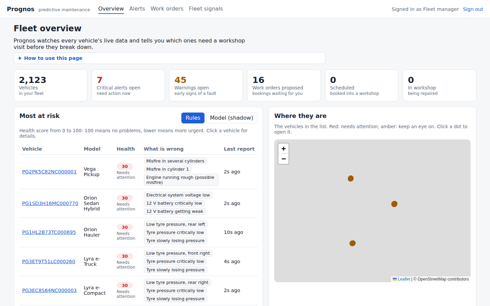
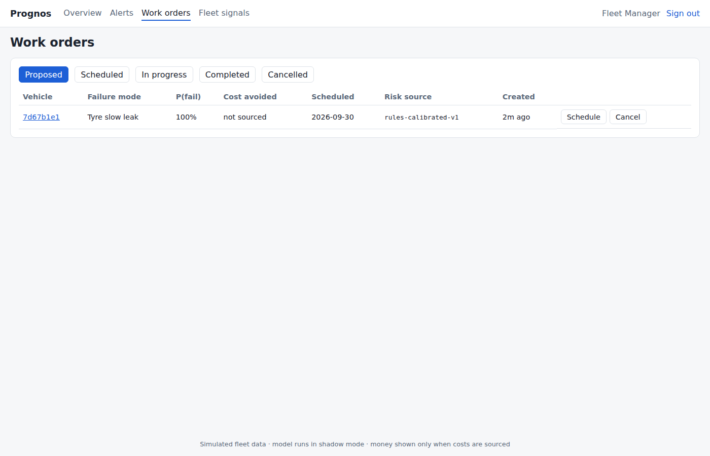
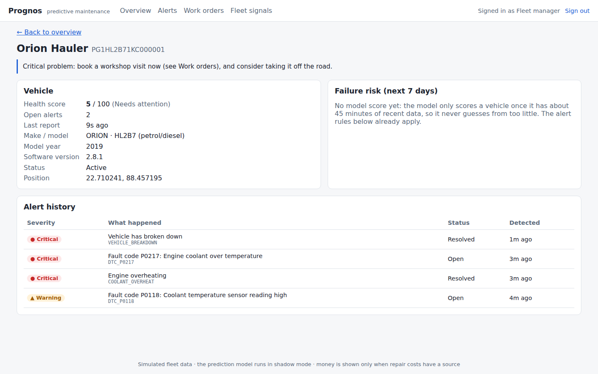
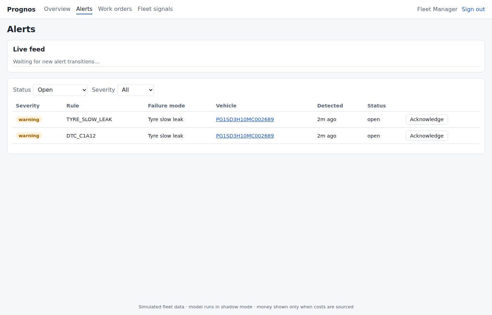
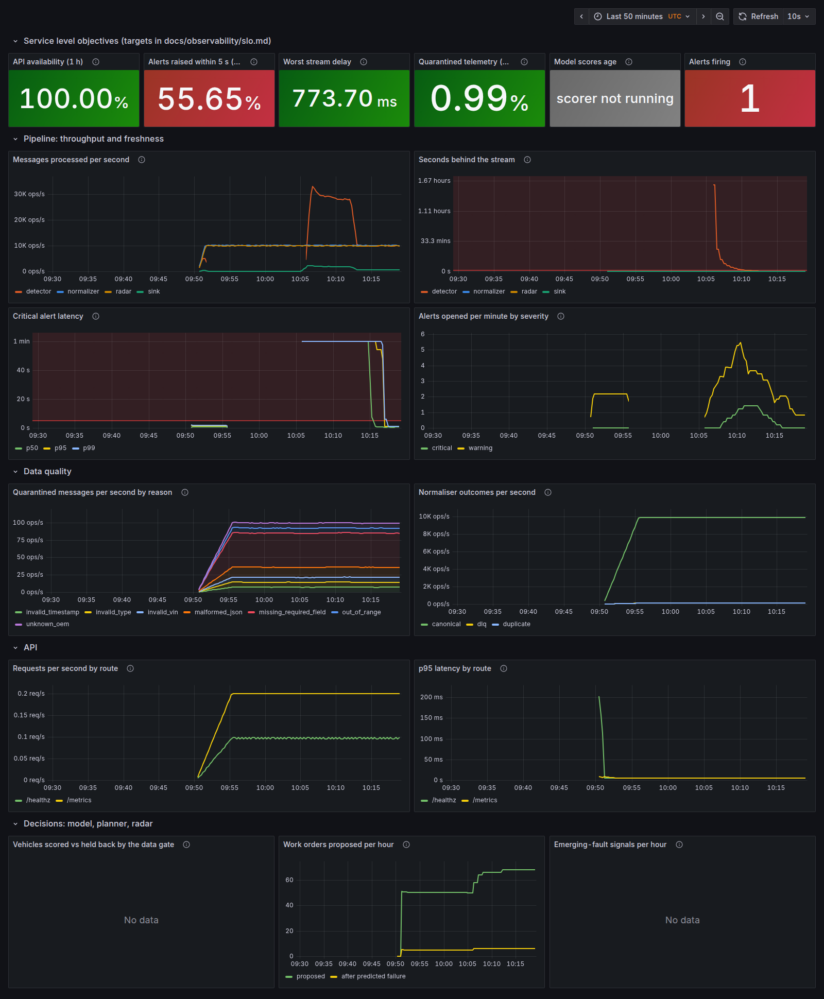

# Prognos: Predictive Maintenance for Connected Vehicle Fleets

> Know which vehicle fails next, and what it will cost if you wait.

Built for the **Connected Vehicle Intelligence Hackathon** by **Pratibimb Gupta**
(RA2311003010027).

**Status:** M0–M15 complete; M16 (cloud) and M17–M19 (docs, demo, audit) remain. See [milestones](#milestones).
Every number in this repository is either measured (with a link to the evidence) or marked
**NOT YET MEASURED**.

---

## 1. Problem

A fleet maintenance manager running a 100,000-vehicle mixed ICE/EV fleet needs a way to know
**which vehicles are likely to fail in the next 7 days, and why**, early enough to book them into
a workshop. Today, faults are discovered as roadside breakdowns or warning lights that nobody can
triage at that scale.

Full analysis and decision matrix: [`docs/product/m0-problem-selection.md`](docs/product/m0-problem-selection.md).

## 2. Solution (target architecture)

```
Simulator (100K vehicles, 3 OEM formats, faults, dup/late/malformed)
   │ Kafka protocol
   ▼
Kafka ── telemetry.raw ─► [normalizer] ─► telemetry.canonical ─► [detector] ─► alerts / vehicle.risk
                              │ invalid ─► telemetry.dlq             │
                              ▼                                      ▼
            ClickHouse (telemetry)   PostgreSQL (alerts, work orders, audit)   Redis (live state)
                              │                                      │
                              └────────► FastAPI (REST + WebSocket) ◄┘ ──► React dashboard
Batch: Parquet → DuckDB → LightGBM (7-day failure model)   Ops: Prometheus · Grafana · OTel
```

## 3. Quick start (macOS)

Prerequisites: Docker Desktop (Memory set to **5 GB**), `uv`, Node 22. Check them with:

```zsh
make doctor
```

Start the stack:

```zsh
make env        # creates .env from .env.example
make bootstrap  # Python dev tools + git hooks
make up         # Kafka, PostgreSQL, ClickHouse, Redis (waits until healthy)
make ps
make topics     # shows the Kafka topics and partitions
make up-obs     # optional: + Prometheus (localhost:9090) and Grafana (localhost:3000)
make down       # stop (keeps data); `make clean` also deletes data
```

Run the same checks CI runs:

```zsh
make check             # lint, types, unit tests, compose validation (no Docker needed for tests)
make test-integration  # 53 tests against real PostgreSQL 17, ClickHouse 25.8, Kafka and Redis (Testcontainers)
```

## 4. Environment variables

All configuration lives in [`.env.example`](.env.example), with laptop-sized defaults.
Values tagged `[scale]` are raised for the 100K-vehicle runs.

| Variable | Default | Purpose |
|---|---|---|
| `VEHICLE_COUNT` | 10000 | Simulated vehicles (100000 for scale runs) |
| `EVENTS_PER_SECOND` | 10000 | Target aggregate rate |
| `BURST_MULTIPLIER` / `BURST_DURATION_SECONDS` | 3 / 300 | Burst profile from the brief |
| `DUPLICATE_RATE` / `OUT_OF_ORDER_RATE` / `MALFORMED_RATE` | 0.01 / 0.02 / 0.005 | Fault injection |
| `KAFKA_TELEMETRY_PARTITIONS` | 6 | Partitions for keyed telemetry topics |
| `KAFKA_REPLICATION_FACTOR` | 1 | 3 with the HA overlay |

## 5. Local resource profile

| Profile | Services | Memory limits (sum) | Measured idle use |
|---|---|---|---|
| core (`make up`) | Kafka, PostgreSQL, ClickHouse, Redis | 3.4 GB | ~0.7 GB ([evidence](evidence/benchmarks/m1-idle-memory.txt)) |
| + observability | + Prometheus, Grafana | 4.0 GB | ~0.8 GB |
| Kafka HA overlay | 3 brokers (RF=3, min ISR=2) | +1.5 GB | [broker-kill smoke test](evidence/chaos/m1-kafka-ha-smoke.md) |

Idle figures were measured in a Linux container, not yet on the target Mac.

## 6. Data model (M2)

- **PostgreSQL (3NF)**: 20 tables for tenants, fleets, vehicles, pseudonymous drivers, RBAC,
  alerts, work orders, cost inputs, erasure requests and an append-only partitioned audit log.
  Business rules live in the schema (composite tenant FKs, exclusion constraints, partial
  unique indexes) and are proven by tests. See [data-model.md](docs/database/data-model.md).
- **ClickHouse**: raw `events` (30-day hot tier, replay-collapsing), a duplicate-safe
  per-minute rollup (400 days), `risk_scores` and `dlq_events`.
- **Seed**: a deterministic roster shared with the simulator (`packages/common`). 100,000
  vehicles load in ~18 s ([evidence](evidence/benchmarks/m2-seed-100k.json), measured on a
  4-vCPU Linux container, not yet on the Mac).

## 7. Vehicle simulator (M3)

`apps/simulator` generates the whole fleet's telemetry. It is vectorised with numpy and sharded
across processes (`SIM_WORKERS`).

- **Three OEM formats:**
  - ORION: flat, metric units.
  - VEGA: nested, imperial units, IST timestamps, DTCs as a single string.
  - LYRA: list of named signals; bar, volts and epoch-millisecond timestamps.
- **Five failure modes with ground truth** (`sim.truth` topic): cooling, misfire, 12 V
  battery, tyre slow leak, and HV battery thermal.
- **Injected anomalies:** network latency, duplicates, out-of-order delivery, missing
  fields and 7 kinds of malformed payload, each counted for reconciliation.

Measured on a 4-vCPU Linux container (not yet on the Mac):
- **100K vehicles at 100K ev/s on one core.** 321K ev/s with 4 workers when not publishing.
- **Live run into Kafka:** 6.06 M messages at the target rate, with every message accounted
  for.
- **3× burst:** not sustained on 4 shared cores (173K ev/s), but with zero loss.

Details: [algorithms.md](docs/algorithms/algorithms.md).

## 8. Ingestion and normalisation (M4)

`apps/stream-processor` (`prognos-normalizer`) consumes `telemetry.raw` in a consumer group and
handles each message in order:

1. Maps each OEM format to the canonical, metric, UTC event (adapters per OEM and schema version).
2. Validates it: required fields, types, ranges, VIN check digit, clock skew.
3. Enriches it with `vehicle_id` and `tenant_id` from PostgreSQL.
4. Drops exact duplicates with a per-vehicle sliding sequence window.
5. Publishes to `telemetry.canonical`, or the original bytes to `telemetry.dlq` with a reason.

Offsets are committed only after every output is acknowledged (at-least-once delivery), and
each event carries a deterministic `event_id` for idempotent sinks. The contract is
[canonical-telemetry-v1.schema.json](packages/schemas/canonical-telemetry-v1.schema.json)
and [asyncapi.yaml](docs/api/asyncapi.yaml).

Measured on a 4-vCPU container shared with Kafka:
- **Throughput:** 25.8K msg/s per process, 62.9K msg/s with 3 processes.
- **Reconciliation:** exact over 1.19 M messages, including a simulator restart, with 0
  duplicate event_ids.
- **Ingest latency, on-time events:** p50 0.35 s, p95 1.04 s.

## 9. Real-time detection (M5)

`prognos-detector` consumes `telemetry.canonical` and keeps O(1) streaming state per vehicle.
It raises alerts in two tiers:
- **Critical, within seconds:** overheating, critical DTCs, tyre, HV and 12 V critical levels,
  and breakdowns.
- **Early warnings from trends:** coolant CUSUM, misfire roughness, resting 12 V voltage,
  tyre deficit against the other tyres (with estimated hours to critical), and HV cell imbalance.

Alerts use hysteresis and deterministic fingerprints (idempotent). The latest health snapshot
per vehicle goes to the compacted `vehicle.state` topic.

Measured:
- **Back-test against ground truth:** 98.6% of breakdowns warned, with a median
  lead of 49.6 h. Precision is 100% in the simulated
  world, which is not a field claim.
- **Live critical alert latency:** p50 0.495 s, p95 1.105 s,
  p99 3.592 s (target < 5 s).

Details and caveats: [detection-baseline.md](docs/performance/detection-baseline.md).

## 10. Persistence (M6)

- **ClickHouse** consumes `telemetry.canonical` and `alerts` directly (Kafka engine and
  materialised views); unparseable messages go to `ingestion_errors`.
- **`prognos-sink`** writes alerts idempotently to PostgreSQL and publishes live state to Redis:
  per-vehicle JSON, a per-tenant health ranking, a geo index, and alert pub/sub for the dashboard.
  It retries database outages with backoff and never commits offsets before the write.
- **`make reconcile`** proves no data loss end to end. Latest run: 1,807,966 raw → 1,772,080
  canonical = 1,772,080 unique rows in ClickHouse with 0 errors; 565 opened alerts = 565 rows in
  PostgreSQL ([evidence](evidence/benchmarks/m6-reconciliation.json)).
- Consistency per data class (CP vs AP): [ADR-004](docs/architecture/adr/ADR-004.md).

## 11. Core intelligence (M7)

- **Calibrated risk.** Each alert rule gets P(failure within 7 days) and a conservative
  deadline (the 10th-percentile time to failure). Both are measured against simulator
  ground truth, with Wilson intervals and right-censoring
  ([rules-v1.json](apps/stream-processor/src/prognos_stream/calibration/rules-v1.json)).
  Held-out check on another seed: 23 of 24 rules fall inside the held-out 95% interval.
  However, the probabilities do **not** beat a base-rate forecast (Brier 0.0226 vs 0.0187),
  because in the simulator almost every detected fault ends in failure. What the
  calibration adds is the per-rule deadlines. Real fleets will differ.
- **`prognos-planner`** turns open alerts into **proposed work orders**:
  - The most valuable vehicles go first, to the nearest same-tenant workshop with free
    capacity before the predicted failure. Bookings made after that point are flagged as
    late.
  - Proposals are idempotent (a partial unique index) and audited (`work_order.propose`).
  - **No fabricated money:** while repair costs are placeholders, ranking uses risk ×
    severity and `expected_cost_avoided` stays empty.
  - Measured on 100K vehicles with 5,000 open alerts: a planning cycle takes 0.9 s, and a
    re-run takes 28 ms and proposes nothing new
    ([evidence](evidence/benchmarks/m7-planner-100k.json)).
- **`prognos-radar`** finds a DTC that is suddenly common in one firmware release or model.
  It compares each cohort with its peers using an exact Poisson tail and a Bonferroni
  correction, and publishes the result to `fleet.signals`. In the back-test it caught the
  injected firmware defect in every window with no other signals, and raised 0 signals on
  the control run ([evidence](evidence/benchmarks/m7-radar-backtest.json)). On the full live
  stack (100K vehicles, 10K ev/s), it flagged only the defective cohort
  ([evidence](evidence/benchmarks/m7-radar-live.json)).
- Try it: `make pipeline-demo` (with the firmware defect), then `make plan` and `make signals-tail`.
- Details: [algorithms A8–A10](docs/algorithms/algorithms.md) and [ADR-006](docs/architecture/adr/ADR-006.md).

> **Costs needed:** real planned/unplanned repair and downtime costs (with a source) are
> required before any money figure is shown. Until then they are labelled placeholders.

## 12. Failure model (M8)

`ml/` (`prognos-ml`) builds a 7-day failure model and tests it against the M7 rules:

- **Data.** Five 8-hour simulated runs of 300 vehicles (about 8.5 M events each) go through
  the production normalizer and detector, and are stored as Parquet.
- **Features.** DuckDB computes per-minute buckets, then 60-minute and 10-minute window
  features. A test proves there is no look-ahead.
- **Model.** LightGBM, trained on two runs and tested on three unseen ones: a held-out run
  and two shifted variants (slower faults, rarer faults).
- **Held-out result** (same rows, same capacity rule for both scorers):

  | | Model | Rules (M7) |
  |---|---|---|
  | PR-AUC | **0.742** | 0.508 |
  | Precision of the top 5% list | **99.7%** | 72.5% |
  | Failures listed ≥ 48 h ahead | **34.7%** | 23.2% |

  The PR-AUC gain is +0.23, with a 95% interval of [0.17, 0.30]. The model also wins on
  both shifted sets ([evidence](evidence/benchmarks/m8-model-vs-baseline.json)).
- **Explanations** (TreeSHAP) come with every prediction. Scoring takes 0.024 ms per vehicle.
- **Versioned artefact** with a checksum: [ml/models/failure-7d-v1](ml/models/failure-7d-v1).

**Limits:** simulated data only; lead times are compressed (median 50 h, below the 72 h
target); money is not computed, because costs are still placeholders; the planner switches
to the model once live scoring exists (M9). Read the
[model card](docs/ml/model-card.md) and [ADR-007](docs/architecture/adr/ADR-007.md) before
quoting any number.

## 13. API and live scoring (M9)

- **`prognos-api` (FastAPI).**
  - **Login:** RS256 JWTs published as JWKS, argon2id password hashes, and a
    brute-force guard.
  - **Access control:** RBAC from the schema's role policy, with strict tenant isolation
    (another tenant's data is `404`). Location is masked for analysts.
  - **Endpoints:** keyset-paginated vehicles, alerts and work orders; a work-order state
    machine; a live alert WebSocket; radar signals.
  - **Operations:** RFC 9457 errors, rate limiting, security headers, Prometheus
    metrics, and an audit trail for every change and every denial.
  - **Tests:** 18 integration tests against real PostgreSQL and Redis.
  - Guide: [docs/api](docs/api/README.md). Contract:
    [openapi.json](docs/api/openapi.json), checked by a test.
- **`prognos-scorer`.**
  - **Pipeline:** ClickHouse computes minute buckets, the training feature SQL runs in
    DuckDB, then LightGBM scores and explains the riskier vehicles.
  - **Outputs:** a Redis ranking and ClickHouse history.
  - **Parity:** a test proves ClickHouse and the training pipeline give identical
    features and predictions.
  - **Speed:** 100,000 vehicles per cycle in about 17 s on 4 vCPU
    ([evidence](evidence/benchmarks/m9-scorer-live.json)).
- **Shadow mode, and why.**
  - The first live run put 8% of the fleet above 0.5. The causes were a
    reporting-rate-dependent feature and slopes fitted to a few minutes of data.
  - Fixes: v3 uses rate-invariant features (verified on a held-out run where vehicles
    report every 10 s: PR-AUC 0.679 vs 0.478), and a data-coverage gate only scores
    vehicles with enough data.
  - The planner and the default ranking stay on the calibrated rules until the model is
    validated on live outcomes ([ADR-008](docs/architecture/adr/ADR-008.md)).
- **Bugs found by tests on the way:**
  - A `DateTime64` insert stored scores as 1970, and the TTL silently deleted them.
  - A non-IP client address crashed the audit insert.
  - The brute-force limiter counted successful logins.

## 14. Dashboard (M10)

`make pipeline-demo users`, then open **http://localhost:8080** and sign in as
`fleet_manager@demo.prognos.local`. The password is `DEMO_USER_PASSWORD` from `.env`.

| Overview | Work orders |
|---|---|
|  |  |
| **Vehicle detail** | **Alerts (live)** |
|  |  |

- **Screens:**
  - Fleet summary tiles.
  - The most-at-risk list, with a **Rules / Model (shadow)** toggle. It says so when the
    model has no scores yet or is only being shown for comparison.
  - A map (OpenStreetMap tiles).
  - Live alerts over the WebSocket, with acknowledge.
  - Work orders with their lifecycle actions.
  - Vehicle detail with the model's reasons in plain words.
  - Radar signals.
- **Permission-aware.** Buttons appear only if your role allows them (a technician gets
  no Acknowledge or Schedule button; an analyst sees masked locations). The API still
  enforces every rule.
- **Honest labels.** Money shows "not sourced" while repair costs are placeholders.
- **Built with** React, TypeScript and Vite: 133 KB gzipped. It is served by nginx on
  the same origin as the API, with a strict CSP.
- **Tests:**
  - 7 component tests (Vitest).
  - 3 Playwright end-to-end tests against the running stack: fleet manager, technician
    and analyst journeys. CI runs them against the nginx container.
- Screenshots were taken in a sandbox without internet access, so the map tiles are
  blank there; they load normally on a connected machine.

## 15. Observability (M11)

`make up-obs pipeline-demo`, then open Grafana at **http://localhost:3000** (user and
password `GRAFANA_ADMIN_*` in `.env`) → *Prognos · service health*. Prometheus is at
http://localhost:9090.



- **SLOs first.** Critical alerts within 5 s (95 %), API availability (99.5 %), data
  freshness and data quality. Each is a Prometheus recording rule
  ([SLO definitions](docs/observability/slo.md)).
- **Alerts:**
  - Multi-window burn-rate SLO alerts (page or ticket), plus pipeline alerts (falling
    behind, stalled, DLQ rate, stale scorer or planner) and `ServiceDown`.
  - Every alert links to a [runbook](docs/observability/runbooks.md) section.
  - `make obs-check` runs the `promtool` unit tests that make each alert fire on a
    synthetic failure and stay quiet on normal traffic. CI runs them too.
- **Dashboards are code** (`make dashboards`). A unit test fails if any panel or rule
  uses a metric that no service exports.
- **Logs** are JSON, one object per line, with a request id shared by the API log and
  the audit log. Tracing is deferred with a reason ([ADR-009](docs/architecture/adr/ADR-009.md)).
- **Failure drill** ([write-up](docs/observability/drills.md),
  [evidence](evidence/chaos/m11-detector-outage-drill.json)):
  - The detector was stopped for 13.5 minutes. The drill found that `up == 0` alerts
    cannot see a service that disappears from DNS discovery; this was fixed with an
    `absent()`-based `ServiceDown` alert.
  - After the restart, the 7.4M-message backlog drained in 7 min 40 s at about 28K
    msg/s. The alert-latency SLO paged because alerts arrived late, which is the
    user-visible impact of the outage.
  - Measured on a 4-vCPU Linux container, not the target Mac.

## 16. Security and privacy (M12)

- **Threat model:** [STRIDE](docs/security/threat-model.md). Each threat links to its
  control, the code and the test that checks it. Eight residual risks are listed with a
  severity and a plan.
- **Two layers of tenant isolation:**
  - API requests run as a restricted PostgreSQL role with row-level security.
  - A query that forgets its tenant filter returns nothing rather than another fleet's
    data ([ADR-010](docs/architecture/adr/ADR-010.md)). Tests run such queries on
    purpose.
- **Right to erasure** ([privacy](docs/security/privacy.md)):
  - A data protection officer files a request (`POST /v1/privacy/erasure-requests`).
  - The `erasure-worker` service removes a vehicle's location history from ClickHouse,
    Redis and the driver links. For a driver, it unlinks the pseudonym.
  - Every step is audited. The request records what remains, and for how long (Kafka
    retention).
  - Live run: 1,935 location rows erased in about 14 s in a table of 19.2M rows
    ([evidence](evidence/security/m12-erasure-live.json)).
- **Tests for known attacks:**
  - 14 forged-token cases: `alg=none`, HS256 key confusion, edited claims, wrong audience.
  - All 5 roles × 17 endpoints checked against the permission policy. The test fails
    if a new endpoint has no access decision.
  - Security headers on every response.
- **Found and fixed:**
  - The dashboard's nginx silently dropped all security headers (CSP,
    X-Frame-Options, …) on every page ([evidence](evidence/security/m12-nginx-headers.txt)).
  - Every database port was published on all interfaces, which exposed Redis and Kafka
    (no auth locally) to the LAN. Ports now bind to `127.0.0.1` (`HOST_BIND`).
- **Supply chain:**
  - Trivy now **fails CI** on any HIGH or CRITICAL finding. The baseline is 0
    ([report](evidence/security/trivy-fs.txt)).
  - Gitleaks: no leaks in the history ([report](evidence/security/gitleaks.txt)).
  - Semgrep on every push; Dependabot weekly. Run locally with `make security-scan`.
- **Not done yet (tracked):**
  - Device identity for Kafka.
  - Redis and Kafka authentication and TLS (cloud, M16).
  - Token revocation before expiry.
  - Automated 2-year purge.
  - Container image CVE scan (M13).

## 17. SQL optimisation (M15)

The slowest queries were **measured**, not guessed.
- **Data:** 100K vehicles plus a generated year of history (2M alerts, 150K work orders).
- **Traffic:** a replay of real dashboard traffic across all 20 tenants (3,055 API
  requests), ranked with `pg_stat_statements`.
- **Plans:** `EXPLAIN ANALYZE` of each query under custom and generic plans
  ([write-up](docs/performance/sql-optimisation.md)).

| Query | Before | After |
|---|---|---|
| Dashboard fleet summary | 1,663 ms mean | **0.97 ms** |
| Work orders by status, next page | 58 ms mean | **0.17 ms** |
| Planner input (active alerts without a work order) | 309 ms | 473 ms: **not improved**, depends on caching; the fix is incremental planning (future work) |

- **Whole workload:** 195.6 s → 23.8 s of API time.
- **Fixes:**
  - Partial and covering indexes, built with `CREATE INDEX CONCURRENTLY` so they don't
    lock the live table.
  - A one-pass `FILTER` rewrite of the summary.
  - A subtle `ORDER BY` bug: the sort bound to a text alias, which no index could serve.
- **Correctness:** tests check that each rewrite returns exactly what the straightforward
  query returns.
- Measured on a 4-vCPU Linux container, not the target Mac.

## 18. Testing (M13)

[Testing strategy](docs/testing/strategy.md): every layer runs in CI on every push.

- **Test counts:**
  - 231 unit, contract and security tests.
  - 78 integration tests against real PostgreSQL, ClickHouse, Kafka and Redis.
  - 5 **BDD** scenarios in Gherkin
    ([feature](tests/integration/features/fleet_manager.feature)): a critical alert
    becomes a scheduled repair, planning twice books once, tenant isolation, role limits
    and location masking.
  - 7 + 4 web tests.
- **Coverage:**
  - Unit and integration combined: **84 %** (branch coverage, all five Python packages).
  - CI fails below 80 % ([report](evidence/coverage/m13-coverage.txt)).
  - Before M13, the coverage configuration silently skipped the API and ML packages.
- **Chaos drill:**
  - PostgreSQL was stopped for 90 s during live ingestion. The sink retried for its 60 s
    budget, then exited without committing. It restarted and Kafka redelivered the batch.
  - Reconciliation: Kafka, ClickHouse and PostgreSQL agree exactly over 3.77M events, and
    all 4 alerts raised during the outage arrived
    ([write-up](docs/observability/drills.md#drill-2-postgresql-goes-away-mid-ingestion-m13-2026-09-30)).
  - The sink now exits with a clear reason instead of a traceback.
- **Image scan:**
  - CI scans every built image and fails on fixable CRITICAL vulnerabilities (0 today).
  - Fixable HIGH findings in base-image OS packages are reported
    ([report](evidence/security/m13-image-scan.txt)).
- **Dependabot** now groups minor and patch updates and ignores majors. A major bump
  needs a deliberate migration.

## 19. Load tests (M14)

[Load tests](docs/performance/load-tests.md): 10K, 50K and 100K vehicles, a capacity
ramp, a burst, a 30-minute soak and 40 concurrent dashboard users. All measured on a
**4-vCPU Linux container, not the target Mac** (the Mac is NOT YET MEASURED).

| Fleet | Critical alert latency p50 / p95 / p99 | CPU (of 4) | Verdict |
|---|---|---|---|
| 10K vehicles | 0.52 / 1.23 / 1.85 s | 0.9 | sustained |
| 50K vehicles | 0.55 / 1.57 / 1.92 s | 1.9 | sustained |
| **100K vehicles** (the brief) | **0.62 / 1.78 / 2.84 s** | 2.9 | sustained, 3.1 GiB |
| 100K at 1.5× rate (15K events/s) | 0.70 / 1.79 / 2.57 s | 3.5 | at the limit of this machine |
| 100K at 2× rate (20K events/s) | 18 / 29 / 30 s | 3.8 | not sustained (CPU saturated) |

- **API under load:** 40 users during the 100K run; p95 of 63–82 ms on every route;
  0 errors.
- **Burst:** the backlog peaked at 587K messages (43 s behind, inside the 60 s SLO) and
  drained 50 s after input returned to normal.
- **Found and fixed:**
  - The detector crash-looped at 100K vehicles: it was OOM-killed at its 512 MB limit,
    because each vehicle's state held a whole event. Per-vehicle state is now 54 %
    smaller, and a new `ServiceRestarting` alert catches crash loops.
  - A login burst froze the API: password hashing ran on the event loop, and logins held
    database connections while they waited. The summary p99 went from 9.9 s to 133 ms.
  - Kafka filled the disk: 1 GB default segments defeat retention. Telemetry topics now
    use 128 MB segments.

## 20. Repository structure

```
apps/        api · simulator · stream-processor · batch · web
packages/    shared schemas (canonical event), common utilities, config
ml/          datasets, features, training, evaluation, model artefacts
database/    postgres (3NF) · telemetry (ClickHouse) · redis key conventions
kafka/       topic declarations (topics.conf) and init script
infra/       docker overlays · monitoring · kubernetes · helm · terraform
tests/       unit · integration · contract · acceptance · load · soak · chaos · security
docs/        product · architecture (+ADRs) · database · algorithms · security · performance
evidence/    measured results only: benchmarks, coverage, security, load tests, chaos
```

## Milestones

| M | Scope | Status |
|---|---|---|
| M0 | Problem selection, MVP, architecture | ✅ Done |
| M1 | Repo bootstrap, Docker Compose, CI, lint/format | ✅ Done |
| M2 | PostgreSQL 3NF + ClickHouse schema, migrations, 100K-vehicle seed | ✅ Done ([data model](docs/database/data-model.md), [ER diagram](docs/database/er-diagram.md)) |
| M3 | Vehicle simulator + standalone benchmark | ✅ Done ([results](docs/algorithms/algorithms.md#measured-results-simulator)) |
| M4 | Kafka ingestion: normalise 3 OEM formats, validate, dedup, DLQ | ✅ Done ([benchmarks](docs/performance/benchmarks.md), [ADR-005](docs/architecture/adr/ADR-005.md)) |
| M5 | Real-time detection: critical rules, trend early-warnings, alerts | ✅ Done ([detection baseline](docs/performance/detection-baseline.md)) |
| M6 | Persistence: ClickHouse Kafka ingestion, PostgreSQL alerts, Redis live state, reconciliation | ✅ Done ([ADR-002..004](docs/architecture/adr/)) |
| M7 | Core intelligence: calibrated risk, capacity-aware work orders, emerging-fault radar | ✅ Done ([A8–A10](docs/algorithms/algorithms.md), [ADR-006](docs/architecture/adr/ADR-006.md)) |
| M8 | ML failure model vs the calibrated-rules baseline (held-out) | ✅ Done ([model card](docs/ml/model-card.md), [ADR-007](docs/architecture/adr/ADR-007.md)) |
| M9 | API (FastAPI, auth, RBAC, WebSocket) + live model scoring | ✅ Done ([API guide](docs/api/README.md), [ADR-008](docs/architecture/adr/ADR-008.md)) |
| M10 | Dashboard (React): fleet map, at-risk list, alerts, work orders, live feed | ✅ Done ([screens](#14-dashboard-m10)) |
| M11 | Observability: metrics dashboards, alerting rules, tracing, SLOs | ✅ Done ([SLOs](docs/observability/slo.md), [drill](docs/observability/drills.md), [ADR-009](docs/architecture/adr/ADR-009.md)) |
| M12 | Security and privacy: STRIDE, row-level security, erasure workflow, headers, scan gate | ✅ Done ([threat model](docs/security/threat-model.md), [privacy](docs/security/privacy.md), [ADR-010](docs/architecture/adr/ADR-010.md)) |
| M13 | Testing: coverage, contract, BDD, chaos | ✅ Done ([strategy](docs/testing/strategy.md), [drills](docs/observability/drills.md)) |
| M14 | Performance: 10K / 50K / 100K / burst / soak | ✅ Done ([load tests](docs/performance/load-tests.md)); on a 4-vCPU Linux container, not the Mac |
| M15 | SQL optimisation: 3 slowest queries, EXPLAIN ANALYZE before/after | ✅ Done ([write-up](docs/performance/sql-optimisation.md)); done before M13/M14 by choice |
| M16 | Cloud deployment (Helm + Terraform) | ⏭ Next |
| M17–M19 | Documentation, demo, final audit | Planned |

## Declarations

- **Data:** all data is synthetic, generated by this repository's simulator. No real personal or
  vehicle-owner data.
- **AI tools:** Claude Code (Anthropic) is used as a coding assistant for design, code, tests and
  documentation. All results are verified by running them.
- **Affiliation:** Motorq is used only as an industry reference. This is an independent academic
  project with no affiliation to Motorq.
- **Licence:** MIT ([LICENSE](LICENSE)).
