# ER Diagram — PostgreSQL relational core (3NF)

Source of truth: [`database/postgres/migrations/`](../../database/postgres/migrations/);
generated snapshot: [`database/postgres/schema.sql`](../../database/postgres/schema.sql).
GitHub renders the Mermaid diagram below.

```mermaid
erDiagram
    oems ||--o{ vehicle_models : makes
    vehicle_models ||--o{ vehicles : "is model of"
    failure_modes ||--o{ failure_mode_powertrains : "applies to"
    failure_modes ||--o{ dtc_codes : "indicated by"
    failure_modes ||--o{ cost_parameters : "priced by"
    failure_modes ||--o{ alerts : classifies
    failure_modes ||--o{ work_orders : "repairs"

    tenants ||--o{ subscriptions : holds
    tenants ||--o{ fleets : owns
    tenants ||--o{ workshops : operates
    tenants ||--o{ drivers : employs
    tenants ||--o{ users : "has staff"
    tenants ||--o{ cost_parameters : configures
    tenants ||--o{ erasure_requests : receives

    fleets ||--o{ vehicles : contains
    workshops ||--o{ vehicles : "is home of"
    vehicles ||--o{ driver_assignments : "driven via"
    drivers ||--o{ driver_assignments : "assigned via"
    vehicles ||--o{ alerts : raises
    vehicles ||--o{ work_orders : "serviced by"
    workshops ||--o{ work_orders : performs
    alerts |o--o{ work_orders : triggers

    roles ||--o{ role_permissions : grants
    roles ||--o{ user_roles : "assigned in"
    users ||--o{ user_roles : has
    users |o--o{ alerts : acknowledges
    users |o--o{ work_orders : creates
    users |o--o{ erasure_requests : files

    oems {
        text oem_code PK
        text display_name UK
        text payload_format
        char3 vin_wmi UK
        bool requires_vin_check_digit
    }
    vehicle_models {
        char5 model_code PK
        text oem_code FK
        text powertrain "ICE|HEV|BEV"
        text vehicle_class
    }
    failure_modes {
        text failure_mode PK
        text display_name UK
        text component
    }
    failure_mode_powertrains {
        text failure_mode PK,FK
        text powertrain PK
    }
    dtc_codes {
        char5 dtc_code PK "SAE J2012 regex"
        text severity
        text failure_mode FK
        bool is_synthetic
    }
    tenants {
        uuid tenant_id PK
        text slug UK
        text data_region
        int location_retention_days
    }
    subscriptions {
        uuid subscription_id PK
        uuid tenant_id FK
        text plan
        int vehicle_limit
        tstzrange valid_during "EXCLUDE overlap per tenant"
    }
    fleets {
        uuid fleet_id PK
        uuid tenant_id FK
        text name "UK(tenant_id,name)"
    }
    workshops {
        uuid workshop_id PK
        uuid tenant_id FK
        numeric latitude
        numeric longitude
        smallint daily_capacity
    }
    vehicles {
        uuid vehicle_id PK
        uuid tenant_id "FK via (fleet_id,tenant_id)"
        uuid fleet_id FK
        char17 vin UK "VIN regex"
        char5 model_code FK
        smallint model_year
        text firmware_version
        text status
        uuid home_workshop_id FK
    }
    drivers {
        uuid driver_id PK
        uuid tenant_id FK
        text pseudonym "DRV-000000 (no PII)"
        timestamptz erased_at
    }
    driver_assignments {
        bigint assignment_id PK
        uuid vehicle_id FK
        uuid driver_id FK
        tstzrange during "EXCLUDE overlap"
    }
    users {
        uuid user_id PK
        uuid tenant_id FK "NULL = platform staff"
        citext email UK
        text password_hash
    }
    roles {
        text role_code PK
    }
    role_permissions {
        text role_code PK,FK
        text permission PK
    }
    user_roles {
        uuid user_id PK,FK
        text role_code PK,FK
    }
    cost_parameters {
        uuid tenant_id PK,FK
        text failure_mode PK,FK
        numeric planned_repair_cost
        numeric unplanned_repair_cost
        text source "mandatory provenance"
    }
    alerts {
        bigint alert_id PK
        uuid vehicle_id FK
        text fingerprint "UK(tenant_id,fingerprint)"
        text severity
        text status
        timestamptz event_ts
        timestamptz detected_at
    }
    work_orders {
        uuid work_order_id PK
        uuid vehicle_id FK
        uuid workshop_id FK
        bigint source_alert_id FK
        text failure_mode FK
        text status "1 active per vehicle+mode"
        numeric failure_probability
        numeric expected_cost_avoided
    }
    erasure_requests {
        uuid request_id PK
        uuid tenant_id FK
        text subject_type
        uuid subject_id
        text status
    }
    audit_log {
        bigint audit_id PK
        timestamptz occurred_at PK "monthly partitions"
        uuid tenant_id "no FK: outlives tenant"
        text action
        text outcome
    }
```

`audit_log` is deliberately unconnected: it must survive deletion of anything it describes.
