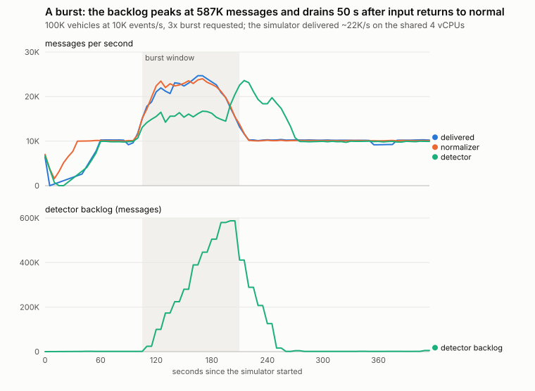
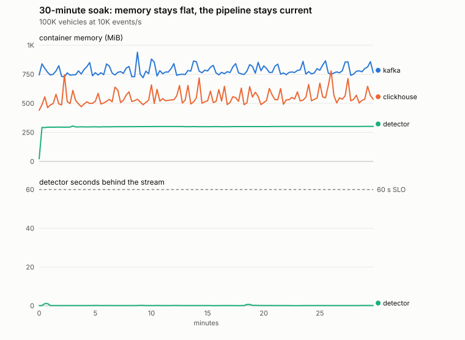

# Load tests (M14)

Measured on a **4-vCPU x86_64 Linux container**. Every service shares those 4 CPUs:
simulator, Kafka, the consumers, PostgreSQL, ClickHouse, Redis and Prometheus. This is
**not the target 8 GB MacBook Air**. Nothing here has been measured on the Mac (**NOT YET
MEASURED**).

**Tools:**
- [`scripts/load_test.py`](../../scripts/load_test.py) seeds the fleet size and drives the
  simulator at a rate. Every 5–15 s it samples Prometheus (per-stage throughput,
  consumer lag, seconds behind, alert latency) and `docker stats`.
- [`scripts/api_load.py`](../../scripts/api_load.py) runs concurrent dashboard users,
  measuring latency on the client side.
- Charts come from [`scripts/gen_perf_charts.py`](../../scripts/gen_perf_charts.py).

Evidence: [`evidence/load-tests/`](../../evidence/load-tests/).

"Sustained" means every consumer group ends under 60 s behind (the freshness SLO), with a
backlog that is not growing.

## Results

| Scenario | Events/s in | Detector msg/s | Detector behind at end | Critical alert latency p50 / p95 / p99 | CPU (of 4) | Memory, all containers | Verdict |
|---|---|---|---|---|---|---|---|
| 10K vehicles | 1,021 | 990 | 0.3 s | 0.52 / 1.23 / 1.85 s | 0.9 | 1.5 GiB | sustained |
| 50K vehicles | 5,015 | 4,951 | 0.2 s | 0.55 / 1.57 / 1.92 s | 1.9 | 2.4 GiB | sustained |
| **100K vehicles** (the brief) | 10,050 | 9,907 | 0.1 s | **0.62 / 1.78 / 2.84 s** | 2.9 | 3.1 GiB | **sustained** |
| 100K + 40 dashboard users | 10,005 | 9,899 | 0.1 s | 0.58 / 1.79 / 5.9 s | 2.9 | 3.0 GiB | sustained |
| 100K at 15K events/s | 15,320 | 14,877 | 0.2 s | 0.70 / 1.79 / 2.57 s | 3.5 | 2.6 GiB | at the limit: kept up for 4 min, detector at 97 % of input |
| 100K at 20K events/s | 20,322 | 17,558 | 35.6 s and growing | 18 / 29 / 30 s | 3.8 | 3.5 GiB | **not sustained**: the machine is saturated |
| 3× burst on 100K | ~22K peak | ~16K during, ~23K after | 0.1 s (43 s max) | during the burst window: p95 56 s | 3.3 | 3.0 GiB | recovers: see chart |
| **30-minute soak, 100K** | 10,106 | 9,898 | 0.1 s (0.7 s max) | 0.59 / 1.83 / 5.04 s | 2.9 | 3.0 GiB | **sustained; memory flat** |

- **Target met on this machine.** The brief's 100K vehicles, each reporting every 10 s,
  runs with every stage current. 95 % of critical alerts are raised within 1.8 s, against
  a 5 s target.
- **Capacity here is about 15K events/s** (1.5× the target). Above that, the detector is
  the first stage to fall behind, because the machine runs out of CPU. It scales out by
  partition (`DETECTOR_REPLICAS`), but only when there are cores to scale into.
- **The Mac will differ.** An M2 core is faster than a vCPU here. However, all
  containers run inside Docker Desktop's VM, whose memory is a setting. At 100K the
  containers used 3.1 GiB here, so that VM needs at least about 4 GB. This has **not been
  measured on the Mac**.

### Burst

- The simulator was asked for 3× (30K/s) for 60 s. On the shared CPUs it delivered about
  22K/s for about 105 s.
- The normalizers kept up throughout.
- The detector, capped near 16K/s, built a backlog of **587K messages**. At most it was
  **43 s behind**, inside the 60 s freshness SLO.
- It drained at about 23K/s, **50 s after input returned to normal**.
- Alerts raised from delayed events were late (p95 56 s across the window), which is
  exactly what the alert-latency SLO is meant to catch.

### Soak

- For 30 minutes at 100K vehicles and 10K events/s, every stage stayed current. The
  detector was never more than 0.7 s behind.
- **No leak:**
  - The detector stayed at 295–305 MB. Kafka (730–940 MB) and ClickHouse (490–780 MB)
    move up and down with their flushes and merges, but do not trend upward.
  - The normalizers step up once, when their vehicle registry is refreshed at 5
    minutes, then hold at 138–151 MB.
  - Redis grows while all 100K vehicles' live state fills in, then flattens at about
    120 MB.
- **Disk:** with 128 MB segments and (for the test) 10-minute retention, disk use
  levelled off. It grew by about 1 GB over the last 25 minutes.
- **p99 alert latency of 5.04 s** sits just above 5 s. The SLO is 95 % within 5 s
  (measured 1.83 s at p95), so it is met, but the tail is close to the target when the
  machine runs at 73 % CPU.

### API under load

40 concurrent fleet managers (1 s think time) ran during the 100K pipeline run: 5,643
requests at 37 requests/s, with **0 errors**
([evidence](../../evidence/load-tests/m14-api-40-users-during-100k.json)).

| Route | p50 | p95 | p99 |
|---|---|---|---|
| fleet summary | 13.6 ms | 67 ms | 133 ms |
| at-risk list | 14.8 ms | 82 ms | 221 ms |
| alerts | 13.0 ms | 66 ms | 137 ms |
| work orders | 11.1 ms | 71 ms | 169 ms |
| vehicles | 17.1 ms | 75 ms | 172 ms |
| vehicle detail | 13.4 ms | 63 ms | 127 ms |

The 0.5 s p95 target for the API ([SLO](../observability/slo.md)) is met on every route.

## What the load tests found and fixed

1. **The detector crash-looped at 100K vehicles.**
   - At 100K the detector exceeded its 512 MB memory limit and the kernel killed it
     (`Memory cgroup out of memory: Killed process ... prognos-detecto`). That happened
     25 times in 5 minutes; it processed about 2.2K of 10K msg/s and fell 150 s behind.
   - The cause: each vehicle's state kept the whole last event (3.6 KB of about
     5.0 KB), although the health snapshot reads 6 fields.
   - Keeping only those, creating the DTC window lazily and interning tenant ids brought
     it to **2.3 KB per vehicle (−54 %)**
     ([benchmark](../../evidence/benchmarks/m14-detector-memory.json),
     `scripts/bench_detector_memory.py`).
   - At 100K the detector now peaks at about 305 MB, with 0 restarts.
2. **No alert saw the crash loop.**
   - Between restarts the target answered, so `ServiceDown` and `TargetDown` stayed
     quiet.
   - A new `ServiceRestarting` alert (more than 2 process starts in 15 min) fired at once
     on the live data (18 restarts). It has a promtool test and a
     [runbook](../observability/runbooks.md#restarting).
3. **A login burst froze the API for up to 10 s.** The dashboard summary's p99 was 9.9 s
   while its median was 10 ms. Two causes, fixed in turn:
   - The argon2id password check (about 70 ms of CPU and 64 MiB each) ran on the async
     event loop and blocked every request. It now runs in a worker thread, one at a time,
     so a burst cannot exhaust the API's memory. p99 went from 9.9 s to 4.9 s.
   - Logins held a database connection while queued for hashing. 40 logins held all 10
     pooled connections, so other requests waited. Logins now hold a connection only
     around their queries. **p99 went from 4.9 s to 133 ms.**
   - Regression tests (`test_login_concurrency.py`) fail on each old version.
4. **Kafka filled the disk.**
   - Retention only deletes closed segments, and the default segment is 1 GB per
     partition. So telemetry piled up whatever `retention.ms` said: Kafka died with "no
     space left on device" during a 30K/s run, and Redis's append-only file was corrupted
     (Redis state is rebuildable).
   - Telemetry topics now use 128 MB segments.
   - Sizing rule: disk ≈ event rate × average message size × retention, plus one segment
     per partition.

## Not measured
- Anything on the target Mac (**NOT YET MEASURED**).
- A true 3× burst (30K/s): the simulator shares the CPUs and delivered about 22K/s.
- Runs longer than 30 minutes; day-long retention at 100K (disk usage).
- Multiple detector replicas, which need more cores than this machine has.
