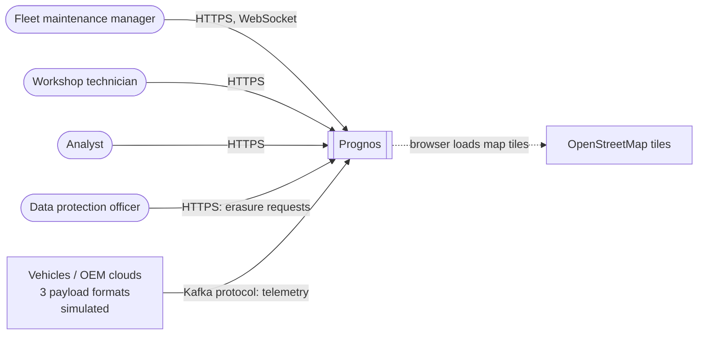
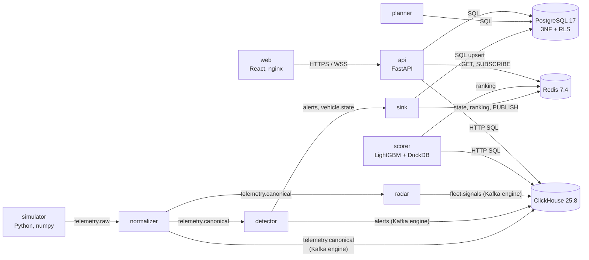
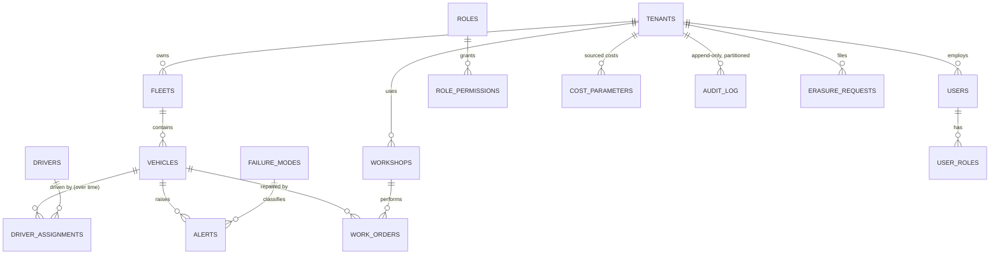
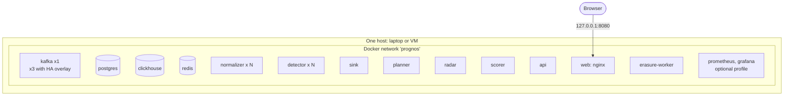
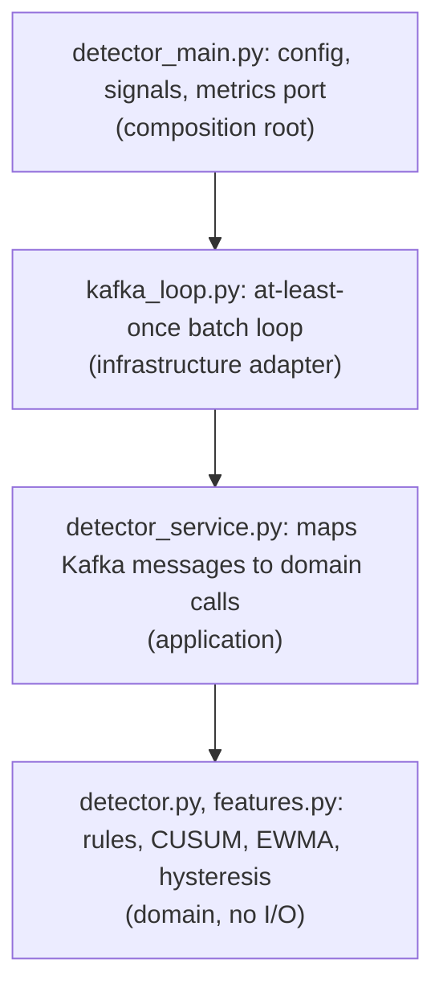
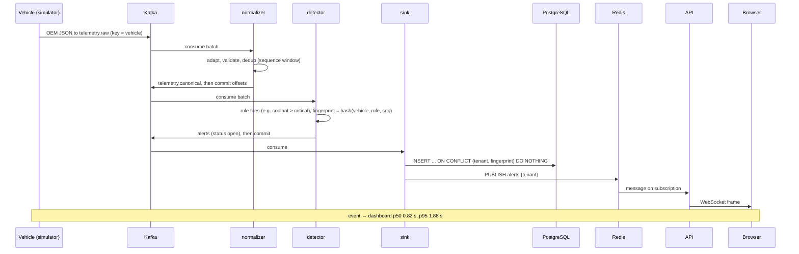
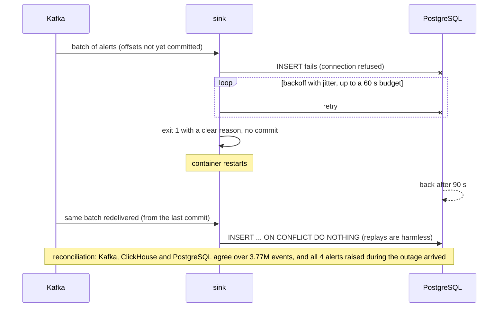

# Prognos: Solution Document

**Connected Vehicle Intelligence Hackathon**

| | |
|---|---|
| **To be submitted by** | Pratibimb Gupta (RA2311003010027). Team name: **[to be provided by the author]** |
| **Team members and roles** | Pratibimb Gupta: sole member, all roles. Email: **[to be provided by the author]** |
| **Problem space chosen** | Predictive maintenance, with a fleet-wide emerging-fault radar |
| **Repository URL** | https://github.com/championorwhat/Connected-Vehicle-Intelligence |
| **Demo video URL (≤ 5 min)** | **[to be recorded; script in M18]** |
| **Date of submission** | 20/09/2026 |

**How to read the numbers.** Every measured number links to the evidence file that
produced it. Anything not measured says **NOT YET MEASURED**. Unless stated otherwise,
measurements come from a **4-vCPU x86_64 Linux container shared by every service**. That
is not the author's target machine (an 8 GB MacBook Air M2), on which nothing has been
measured yet. All data is synthetic.

## Table of contents

1. [Executive Summary](#1-executive-summary)
2. [Problem Statement & Validation](#2-problem-statement--validation)
3. [Solution Description](#3-solution-description)
4. [Feature List](#4-feature-list)
5. [Solution Architecture (High-Level Design)](#5-solution-architecture-high-level-design)
6. [Low-Level Design](#6-low-level-design)
7. [Non-Functional Requirements & Performance Benchmarks](#7-non-functional-requirements--performance-benchmarks)
8. [Security & Compliance](#8-security--compliance)
9. [Test Strategy](#9-test-strategy)
10. [Observability](#10-observability)
11. [AI / ML Component](#11-ai--ml-component)
12. [Architecture Decisions, Risks & Future Enhancements](#12-architecture-decisions-risks--future-enhancements)
13. [Demo Video](#13-demo-video-5-minutes-maximum)
14. [Repository Checklist](#14-repository-checklist)
15. [Conclusion](#15-conclusion)
16. [Declarations](#16-declarations)
17. [Appendix](#17-appendix)

---

## 1. Executive Summary

**Problem.** A fleet maintenance manager with 100,000 mixed petrol, diesel and electric
vehicles learns about most faults when a vehicle breaks down at the roadside or a warning
light comes on. At that scale nobody can triage the signals by hand, so repairs are
unplanned, and unplanned repairs cost more than planned ones.

**Solution.** Prognos reads telemetry from vehicles of three different makes, raises a
critical alert within seconds, predicts which vehicles are likely to fail within 7 days
and why, and proposes a workshop booking before the predicted failure.

**Key results** (measured; 4-vCPU Linux container):

| What | Result | Target |
|---|---|---|
| 100K vehicles, one event every 10 s each (10K events/s) | every pipeline stage keeps up ([evidence](../../evidence/load-tests/m14-100k.json)) | 100K vehicles at ~1 event/s each |
| Critical alert latency, 100K vehicles | p95 **1.78 s** ([evidence](../../evidence/load-tests/m14-100k.json)) | < 5 s |
| Event → dashboard, 100K vehicles | p95 **1.88 s** ([evidence](../../evidence/load-tests/m17-dashboard-freshness-100k.json)) | < 2 s |
| API with 40 users during the 100K run | p95 63–82 ms, **0 errors** ([evidence](../../evidence/load-tests/m14-api-40-users-during-100k.json)) | p95 < 200 ms |
| Breakdowns warned before they happened (simulated back-test) | **98.6 %**, median 49.6 h ahead ([evidence](../../evidence/benchmarks/m5-detection-backtest.json)) | – |
| Failure model vs rules, held-out data | PR-AUC **0.742 vs 0.508** ([evidence](../../evidence/benchmarks/m8-model-vs-baseline.json)) | beat the baseline |
| End-to-end ingest at 100K events/s | **not reached**: this 4-vCPU machine sustains about 15K events/s end to end ([evidence](../../evidence/load-tests/m14-capacity-15000.json)) | 100K+ events/s |

**What is different.**
- **Evaluated against ground truth.** The simulator records when each injected fault
  really fails, so recall, lead time and model quality are measured, not asserted.
- **Honest money.** Work orders are ranked by calibrated risk and capacity. The system
  refuses to show a money figure until repair costs have a cited source.
- **Emerging-fault radar.** It finds a fault code that suddenly spikes in one firmware
  release, using exact statistics, with no false signals in the tests.
- **Measured, then fixed.** Load tests found a crash loop, an API freeze and a disk-filling
  Kafka setting. SQL tuning cut the replayed dashboard workload from 195.6 s to 23.8 s
  of API time. Each fix has evidence.

## 2. Problem Statement & Validation

### 2.1 Problem Statement

> **A fleet maintenance manager** running a 100,000-vehicle mixed ICE/EV fleet **needs a
> way to** know which vehicles are likely to fail in the next 7 days, and why, early enough
> to book them into a workshop, **because** faults today surface as roadside breakdowns or
> warning lights that nobody can triage across tens of thousands of vehicles, **which
> today costs** [unplanned breakdowns per 1,000 vehicles per month] × [(unplanned − planned
> repair cost) + downtime cost per day × extra downtime days].

The cost is a **formula, not a number.** Its parameters are **NOT SOURCED** (see 2.2),
and Prognos does not invent them.

**Primary user:** the fleet maintenance manager, who owns vehicle uptime and the workshop
schedule.

**Secondary stakeholders:**

| Stakeholder | Interest |
|---|---|
| Workshop technicians | A work order with the suspected component and the evidence, not just a fault code |
| Drivers | Fewer roadside breakdowns; their location is minimised and masked |
| Fleet finance | Cost avoided against inspection cost (needs sourced costs) |
| OEM quality and warranty teams | A fault spreading across one model or firmware release |
| Data protection officer | Retention, erasure and an audit trail (GDPR; India's DPDP Act 2023) |

The choice among the eight official problem spaces is scored in the
[M0 decision matrix](../product/m0-problem-selection.md) (section 2).
Predictive maintenance won because every 1 Hz signal matters to it, it needs both the
real-time and the batch path, and a simulator can supply ground truth.

### 2.2 Evidence & Validation

**Facts vs assumptions.**

| Evidence / Assumption | Source or method | What it shows | Confidence |
|---|---|---|---|
| **Fact (brief):** 100K vehicles, 100K+ events/s, critical alerts < 5 s, dashboard < 2 s | Hackathon problem statement | The scale and latency the product must meet | High |
| **Fact (industry):** US truck repair and maintenance averaged 21.5 US cents per mile in 2025, up 8.6 % on 2024 (parts, labour and roadside service; excluding tyres and towing) | ATRI, *An Analysis of the Operational Costs of Trucking* (2026 update), as reported by trade press ([FleetOwner](https://www.fleetowner.com/operations/article/55392569/atri-report-breaks-down-class-8-truck-operating-costs-by-region-and-expense-category), [Transport Topics](https://www.ttnews.com/articles/atri-truck-costs-2025)). The original report was **not read** (not reachable from the build environment) | Maintenance is a large, rising line item | Medium (secondary reporting) |
| **Assumption:** an unplanned roadside repair costs several times a planned repair of the same component (towing, emergency labour, downtime) | Vendor blogs claim 3–9×; **no independent study was read** | Why finding faults early pays | Low. Used in **no** calculation |
| **Fact (simulated):** trend rules warn of 98.6 % of breakdowns, a median of 49.6 h ahead | Back-test against the simulator's ground truth ([evidence](../../evidence/benchmarks/m5-detection-backtest.json)) | Early warning is possible when faults degrade gradually | High for the simulator; real fleets NOT YET MEASURED |
| **Fact (simulated):** a gradient-boosted model beats the rules on held-out runs (PR-AUC +0.23, 95 % interval [0.17, 0.30]) | Held-out runs and two shifted variants ([evidence](../../evidence/benchmarks/m8-model-vs-baseline.json)) | Learning from telemetry adds value over fixed rules | Medium: may learn the simulator |
| **Assumption:** a mixed fleet uses several telematics sources with different formats | Design premise; modelled as 3 OEM formats | Normalisation is needed before any analysis | Medium |

**Validation method.** Simulation with ground truth. The simulator
([algorithms A1–A4](../algorithms/algorithms.md)) degrades five components along
plausible curves and records the true failure time. Detection, calibration and the model
are all scored against it, on runs they were not tuned on. No interviews were held, and no
public fleet dataset with failure labels was used.

**Existing alternatives, and why they fall short for this user.**

| Alternative | Falls short because |
|---|---|
| OEM portals | Each covers one brand; a mixed fleet gets several portals and no single ranked list |
| Aftermarket dongles and generic telematics | Report fault codes and positions; the triage of tens of thousands of codes is left to the manager |
| Integration platforms (e.g. Motorq Fuse) | Normalise and deliver vehicle data; deciding which vehicle to book, and where, is left to the customer. This is our reading of the public positioning; no product was tested |
| Fixed-interval servicing | Ignores the vehicle's condition: services healthy vehicles and misses fast faults |

### 2.3 Impact & Success Metrics

| Metric | Baseline today | Target | Achieved | How measured |
|---|---|---|---|---|
| Breakdowns warned ≥ 48 h ahead (recall, top-5 % capacity list) | Rules: 23.2 % | Beat the rules | **Model: 34.7 %** | Held-out back-test ([evidence](../../evidence/benchmarks/m8-model-vs-baseline.json)) |
| Precision of the at-risk list (top 5 %) | Rules: 72.5 % | Beat the rules | **Model: 99.7 %** | Same back-test |
| Median prediction lead time | Rules: 38.1 h | ≥ 72 h | Model: 50.4 h (**target not met**) | Same back-test |
| Expected cost avoided per 1,000 vehicles per month | – | Positive after inspection cost | **NOT COMPUTED**: costs not sourced | Back-test × sourced costs |
| Critical alert latency | – | p95 < 5 s | **p95 1.78 s** at 100K vehicles | Live load test ([evidence](../../evidence/load-tests/m14-100k.json)) |
| Event → dashboard | – | < 2 s | **p95 1.88 s** at 100K vehicles | WebSocket client ([evidence](../../evidence/load-tests/m17-dashboard-freshness-100k.json)) |

**Scale of impact.** The pipeline's cost grows with events, not with users. On the same
4 vCPUs, 10K vehicles used 0.9 CPUs and 1.5 GiB; 100K vehicles used 2.9 CPUs and 3.1 GiB
([load tests](../performance/load-tests.md#results)). The manager's work does not grow
that way: the at-risk list is capped at workshop capacity, so a 100K fleet produces a
bounded daily list of proposed bookings rather than 10× more alerts to read.

**Wider impact.** Safety: fewer vehicles failing in traffic (tyre and overheating faults
are raised within seconds). Environment: fewer tow-truck trips, and a planned repair
replaces only the failing part. Compliance: location is minimised, masked and erasable
(§8). These are qualitative; none is measured.

## 3. Solution Description

### 3.1 Solution Overview & User Journey

**What it does.** Prognos collects telemetry from three vehicle makes, converts it into
one format, watches every vehicle continuously, and turns what it sees into three things
for the fleet manager: an immediate alert when something is critical, a ranked list of
vehicles likely to fail this week with the reasons, and proposed workshop bookings.

**User journey.**

| Step | What happens | Where |
|---|---|---|
| 1. Vehicle | Emits telemetry in its maker's format; a degrading part shifts its signals | `apps/simulator` |
| 2. Ingest | Kafka `telemetry.raw`, keyed by vehicle | [ADR-001](../architecture/adr/ADR-001.md) |
| 3. Normalise | Map to the canonical event, validate, drop duplicates; rejects go to the DLQ with a reason | `normalizer` |
| 4. Detect | Critical rules fire at once; trend statistics raise early warnings | `detector` |
| 5. Store | Alerts → PostgreSQL; live state → Redis; history → ClickHouse | `sink`, ClickHouse Kafka engine |
| 6. Predict | Every 5 minutes the model scores the fleet (shadow mode) | `scorer` |
| 7. Plan | Open alerts become proposed work orders at the nearest workshop with capacity | `planner` |
| 8. Act | The manager sees the alert live, acknowledges it and schedules the work order | dashboard |
| 9. Outcome | The technician completes the order with an outcome; every step is audited | API, `audit_log` |

**Screenshots of the working product** (more in the [README](../../README.md#14-dashboard-m10)):

| Fleet overview | Work orders |
|---|---|
|  |  |
| **Vehicle detail, with the model's reasons** | **Live alerts** |
|  |  |

The screenshots were taken without internet access, so the map tiles are blank.

### 3.2 Key Value Proposition

- **Customer job:** keep the fleet on the road by repairing vehicles before they break
  down, within the workshops' capacity.
- **Pain relieved:** fewer roadside breakdowns, and a short, ranked list in place of
  thousands of raw fault codes. Critical faults arrive within seconds.
- **Gain created:** a prediction for each vehicle (likely to fail within 7 days, and
  why), a proposed booking before the failure, and early notice when a fault spreads
  across a model or firmware release.
- **Differentiation:** Prognos is judged against ground truth, not demos. It says "not
  sourced" rather than invent a saving, keeps the model in shadow until it is validated on
  live outcomes, and measures its own latency against published SLOs.

### 3.3 Innovative Ideas

| Idea | What is new | Evidence |
|---|---|---|
| **1. A simulator with ground truth, used as the test oracle** | Telemetry demos usually cannot say whether a prediction was right. Here five failure modes degrade along physical signatures, and the simulator publishes the true failure time. Rule recall, calibration, deadlines and the ML model are scored against it on runs they were not fitted on. | Back-test: 98.6 % of breakdowns warned, median lead 49.6 h ([evidence](../../evidence/benchmarks/m5-detection-backtest.json)); calibration held-out on another seed, 23 of 24 rules inside the 95 % interval ([evidence](../../evidence/benchmarks/m7-calibration-holdout-seed7.json)) |
| **2. A capacity-aware planner that refuses fabricated money** | Each alert rule gets a measured probability and a conservative deadline (10th-percentile time to failure). The planner books the most valuable vehicles first into the nearest workshop with capacity before that deadline. Value in money is computed only from costs that cite a source; the database rejects a cost without one. | 100K vehicles, 5,000 open alerts: a cycle takes 0.90 s, and a re-run proposes nothing new in 28 ms ([evidence](../../evidence/benchmarks/m7-planner-100k.json)); `test_cost_parameters_require_provenance` |
| **3. Emerging-fault radar with exact statistics** | Compares each model or firmware cohort with like-for-like peers, counting distinct vehicles, with an exact Poisson tail and a Bonferroni correction. The M0 plan proposed a Count-Min Sketch; it was rejected because the keys are few and a sketch only adds error. | Defect found in every window, **0 false signals** on a control run ([evidence](../../evidence/benchmarks/m7-radar-backtest.json)); live at 100K vehicles, only the defective cohort flagged ([evidence](../../evidence/benchmarks/m7-radar-live.json)) |

## 4. Feature List

Every feature is traceable to code, a test and evidence in
[`docs/feature-traceability.csv`](../feature-traceability.csv), which has the full
columns. The table below is generated from that file (`scripts/sync_solution_document.py`);
a unit test fails if they differ. Video times marked "(script)" come from the
[demo script](../demo/demo-script.md); they are confirmed once the video is recorded.

<!-- features:start -->
| ID | Feature | User story | Priority | Status | Code path | Video |
|---|---|---|---|---|---|---|
| F-00 | One-command local stack | As a developer I want one command to start the data plane so that anyone can run Prognos locally | Must | Done | `docker-compose.yml`<br>`Makefile` | – |
| F-00b | Replicated durable messaging | As a platform engineer I want telemetry to survive a broker failure so that no events are lost | Must | Partial | `infra/docker/compose.kafka-ha.yml`<br>`kafka/topics/` | – |
| F-01 | Multi-tenant relational core (3NF) | As a fleet manager I want my fleet data isolated from other customers so that it is never exposed or corrupted | Must | Done | `database/postgres/migrations/` | – |
| F-02 | Telemetry store with duplicate-safe rollups | As a fleet manager I want vehicle history kept for trend analysis so that slow degradation is visible | Must | Done | `database/telemetry/migrations/` | – |
| F-03 | Deterministic 100K-vehicle synthetic fleet | As a platform engineer I want a reproducible 100K-vehicle dataset so that every benchmark is repeatable | Must | Done | `packages/common/src/prognos_common/roster.py`<br>`database/postgres/seeds/load_seed.py` | – |
| F-04 | VIN and DTC validation | As a platform engineer I want malformed identifiers rejected so that bad OEM data never reaches analytics | Must | Done | `packages/common/src/prognos_common/vin.py`<br>`packages/common/src/prognos_common/dtc.py` | – |
| F-05 | Append-only audit log | As a DPO I want an immutable record of data access so that accountability can be demonstrated | Must | Partial | `database/postgres/migrations/20260929000001_core_schema.sql` | – |
| F-06 | Scalable multi-OEM telemetry simulator | As a platform engineer I want realistic 100K-vehicle telemetry in three OEM formats so that the pipeline is tested against real-world variety and scale | Must | Done | `apps/simulator/src/prognos_sim/` | – |
| F-07 | Fault injection with ground truth | As a data scientist I want known failure onset and failure times so that predictions can be evaluated honestly | Must | Done | `apps/simulator/src/prognos_sim/fleet.py` | – |
| F-08 | Delivery anomaly injection (duplicates / out-of-order / malformed / missing) | As a platform engineer I want realistic bad data so that validation, dedup and DLQ are proven | Must | Done | `apps/simulator/src/prognos_sim/engine.py`<br>`apps/simulator/src/prognos_sim/formats.py` | – |
| F-09 | Multi-OEM normalisation to a canonical event | As a platform engineer I want every OEM format mapped to one schema so that downstream logic is written once | Must | Done | `apps/stream-processor/src/prognos_stream/adapters.py` | – |
| F-10 | Validation with dead-letter queue | As a platform engineer I want invalid payloads quarantined with a reason so that bad data never reaches analytics and can be replayed | Must | Done | `apps/stream-processor/src/prognos_stream/processor.py`<br>`apps/stream-processor/src/prognos_stream/service.py` | – |
| F-11 | Exact duplicate suppression with out-of-order tolerance | As a fleet manager I want each event counted once so that alerts and costs are not double counted | Must | Done | `apps/stream-processor/src/prognos_stream/dedup.py` | – |
| F-12 | Critical real-time alerts (< 5 s) | As a fleet manager I want to know within seconds when a vehicle overheats or breaks down so that I can act before damage spreads | Must | Done | `apps/stream-processor/src/prognos_stream/detector.py` | 01:15 (script) |
| F-13 | Early-warning trend detection | As a fleet manager I want warnings days before a breakdown so that repairs can be planned | Must | Done | `apps/stream-processor/src/prognos_stream/features.py`<br>`apps/stream-processor/src/prognos_stream/detector.py` | 01:40 (script) |
| F-14 | Tyre leak rate and time-to-critical estimate | As a fleet manager I want to know how long a leaking tyre can keep running so that I can schedule the fix | Should | Done | `apps/stream-processor/src/prognos_stream/detector.py` | – |
| F-15 | Detection back-test harness | As a data scientist I want to score detection against ground truth so that every change to rules or models is measured | Must | Done | `apps/stream-processor/src/prognos_stream/evaluate.py` | 04:15 (script) |
| F-16 | Telemetry history in ClickHouse via Kafka engine | As an analyst I want every event stored for trend analysis so that history is complete | Must | Done | `database/telemetry/migrations/20260930000002_kafka_ingestion.sql` | – |
| F-17 | Idempotent alert persistence | As a fleet manager I want each alert recorded once with its lifecycle so that I can act on and audit it | Must | Done | `apps/stream-processor/src/prognos_stream/sinks.py` | – |
| F-18 | Live vehicle state and at-risk ranking in Redis | As a fleet manager I want a live view ranked by risk so that I see the worst vehicles first | Must | Done | `apps/stream-processor/src/prognos_stream/sinks.py` | – |
| F-19 | End-to-end no-data-loss reconciliation | As a platform engineer I want proof that nothing is lost between Kafka and the stores so that the brief's no-loss requirement is evidenced | Must | Done | `scripts/reconcile.py` | – |
| F-20 | Calibrated failure risk per rule | As a fleet manager I want each warning to say how likely and how soon a failure is so that I can compare vehicles | Must | Done | `apps/stream-processor/src/prognos_stream/evaluate.py`<br>`scripts/build_calibration.py`<br>`apps/stream-processor/src/prognos_stream/calibration/rules-v1.json` | – |
| F-21 | Cost-aware prioritisation (no fabricated money) | As a finance owner I want vehicles ranked by expected cost avoided only when the costs are real so that no decision rests on invented figures | Must | Done | `apps/stream-processor/src/prognos_stream/planner.py` | 02:05 (script) |
| F-22 | Capacity-aware work-order proposals with audit trail | As a workshop planner I want proposed bookings that respect daily capacity and the failure deadline so that the most valuable repairs happen first | Must | Done | `apps/stream-processor/src/prognos_stream/planner.py`<br>`apps/stream-processor/src/prognos_stream/planner_main.py` | 02:05 (script) |
| F-23 | Emerging-fault radar (firmware / model cohorts) | As an OEM quality engineer I want to know when one firmware or model shows a DTC far more often than its peers so that a systematic defect is caught before it spreads | Should | Done | `apps/stream-processor/src/prognos_stream/radar.py`<br>`apps/stream-processor/src/prognos_stream/radar_main.py`<br>`apps/simulator/src/prognos_sim/engine.py (firmware_defect)` | 02:35 (script) |
| F-24 | Backfill training dataset from the production pipeline | As a data scientist I want training data produced by the same normalizer and detector as the live system so that the model learns what it will see in production | Must | Done | `ml/src/prognos_ml/dataset.py` | – |
| F-25 | Leak-free window features (DuckDB over Parquet) | As a data scientist I want features that only use the past so that offline results hold in production | Must | Done | `ml/src/prognos_ml/features.py` | – |
| F-26 | 7-day failure model vs rule baseline on held-out data | As a fleet manager I want a better at-risk list than the rules so that workshop slots go to vehicles that will really fail | Must | Done | `ml/src/prognos_ml/model.py`<br>`ml/src/prognos_ml/pipeline.py` | 04:15 (script) |
| F-27 | Per-prediction explanations and versioned model artefact | As a fleet manager I want to see why a vehicle is flagged so that I trust and can challenge the list | Must | Done | `ml/src/prognos_ml/model.py`<br>`ml/models/failure-7d-v1/` | – |
| F-28 | Secure login and tokens (RS256 JWT + JWKS; argon2id; brute-force guard) | As a fleet manager I want a secure login so that only my staff see my fleet | Must | Done | `apps/api/src/prognos_api/security.py`<br>`apps/api/src/prognos_api/routers/auth.py` | – |
| F-29 | Role-based access and tenant isolation with audit of denials | As a data owner I want each role to see only what it needs and no tenant to see another so that data is protected | Must | Done | `apps/api/src/prognos_api/deps.py`<br>`apps/api/src/prognos_api/routers/` | – |
| F-30 | Fleet REST API (vehicles; alerts; work-order lifecycle) with keyset pagination | As a dashboard developer I want stable paginated endpoints so that the UI stays fast at 100K vehicles | Must | Done | `apps/api/src/prognos_api/routers/` | – |
| F-31 | Live alert feed over WebSocket | As a fleet manager I want new alerts pushed to my screen so that I react within seconds | Must | Done | `apps/api/src/prognos_api/routers/live.py` | 01:15 (script) |
| F-32 | Live model scoring with training/serving parity and a data gate | As a data scientist I want production scores computed exactly like training features so that offline results carry over | Must | Done | `ml/src/prognos_ml/scorer.py`<br>`ml/src/prognos_ml/features.py` | – |
| F-33 | Shadow deployment of the model (rules stay in charge until validated) | As a fleet manager I want the model introduced safely so that an unvalidated model never drives bookings | Must | Done | `apps/stream-processor/src/prognos_stream/planner_main.py`<br>`apps/api/src/prognos_api/routers/vehicles.py` | 01:00 (script) |
| F-34 | Fleet dashboard: summary; at-risk list with rules/model toggle; map | As a fleet manager I want one screen that shows which vehicles need attention and where so that I can act in seconds | Must | Done | `apps/web/src/pages/Overview.tsx`<br>`apps/web/src/components/FleetMap.tsx` | 01:00 (script) |
| F-35 | Live alerts view with acknowledge | As a fleet manager I want new alerts to appear without refreshing so that nothing is missed | Must | Done | `apps/web/src/pages/Alerts.tsx` | 01:15 (script) |
| F-36 | Work-order board with role-aware lifecycle actions | As a workshop planner I want to schedule, start and complete work orders so that repairs are tracked to an outcome | Must | Done | `apps/web/src/pages/WorkOrders.tsx` | 02:05 (script) |
| F-37 | Vehicle detail with plain-language model reasons | As a fleet manager I want to know why a vehicle is flagged so that I can trust or challenge it | Should | Done | `apps/web/src/pages/VehicleDetail.tsx`<br>`apps/web/src/format.ts` | 01:40 (script) |
| F-38 | SLOs with multi-window burn-rate alerts and runbooks | As an operator I want to be paged only when users are affected so that alerts are trusted | Must | Done | `infra/monitoring/prometheus/rules/prognos.rules.yml`<br>`docs/observability/runbooks.md` | – |
| F-39 | Service-health dashboard generated from code | As an operator I want one screen that shows which pipeline stage is failing so that I can act fast | Must | Done | `scripts/gen_dashboards.py`<br>`infra/monitoring/grafana/dashboards/prognos-overview.json` | 03:00 (script) |
| F-40 | Structured JSON logs with request ids | As an operator I want to follow one request through the logs and audit log so that I can explain a failure | Should | Done | `packages/common/src/prognos_common/logs.py`<br>`apps/api/src/prognos_api/main.py` | – |
| F-41 | Failure drill: detect a lost service and recover from the backlog | As an operator I want proof that outages are detected so that I can rely on the monitoring | Should | Done | `infra/monitoring/prometheus/rules/prognos.rules.yml` | 03:25 (script) |
| F-42 | PostgreSQL row-level security as a second tenant barrier | As a fleet customer I want my data isolated even if the application has a bug so that competitors never see it | Must | Done | `database/postgres/migrations/20261002000004_row_level_security.sql`<br>`apps/api/src/prognos_api/deps.py` | – |
| F-43 | Right-to-erasure workflow (DPO request + worker across PostgreSQL / ClickHouse / Redis) | As a data protection officer I want to erase a driver's or vehicle's personal data and prove it so that the fleet meets privacy law | Must | Done | `apps/api/src/prognos_api/routers/privacy.py`<br>`apps/api/src/prognos_api/erasure.py` | – |
| F-44 | STRIDE threat model with controls mapped to tests | As a security reviewer I want every threat tied to a control and a test so that claims can be checked | Must | Done | `docs/security/threat-model.md` | – |
| F-45 | Security headers and loopback-only ports | As an operator I want safe defaults so that a laptop demo does not expose data | Must | Done | `apps/web/security-headers.inc`<br>`docker-compose.yml` | – |
| F-46 | Dependency and secret scanning gate | As a maintainer I want vulnerable dependencies and leaked secrets to fail the build so that they never ship | Should | Done | `.github/workflows/security.yml`<br>`.trivyignore`<br>`.github/dependabot.yml` | – |
| F-47 | Measured SQL optimisation of the three slowest queries | As a fleet manager I want the dashboard to load instantly even with years of alert history so that I can act without waiting | Must | Done | `apps/api/src/prognos_api/routers/live.py`<br>`apps/api/src/prognos_api/routers/work_orders.py`<br>`database/postgres/migrations/20261003000005_alerts_active_index.sql` | – |
| F-48 | Combined coverage gate (unit + integration >= 80 %) | As a maintainer I want untested code to fail the build so that quality does not erode | Must | Done | `.github/workflows/ci.yml`<br>`pyproject.toml`<br>`Makefile` | – |
| F-49 | BDD acceptance scenarios for the core user journeys | As a product owner I want the main journeys written as executable scenarios so that behaviour is checked in plain language | Should | Done | `tests/integration/features/fleet_manager.feature` | – |
| F-50 | Chaos drill: database outage without data loss | As an operator I want proof that a database outage loses nothing so that I can trust recovery | Should | Done | `apps/stream-processor/src/prognos_stream/sink_main.py` | 03:25 (script) |
| F-51 | Container image vulnerability gate | As a security reviewer I want shipped images scanned so that known critical flaws never deploy | Should | Done | `.github/workflows/ci.yml`<br>`.github/dependabot.yml` | – |
| F-52 | Load tests at 10K/50K/100K vehicles with capacity ramp and burst | As an operator I want to know how many vehicles the platform handles and how it degrades so that I can size it | Must | Done | `scripts/load_test.py`<br>`scripts/api_load.py` | 03:25 (script) |
| F-53 | Detector memory sized for 100K vehicles (crash-loop fix) | As an operator I want the detector to fit its memory limit at full fleet size so that alerts are not delayed by restarts | Must | Done | `apps/stream-processor/src/prognos_stream/detector.py` | – |
| F-54 | Login bursts do not stall the API | As a fleet manager I want the dashboard to stay fast when everyone signs in at shift start so that I can work immediately | Must | Done | `apps/api/src/prognos_api/routers/auth.py`<br>`apps/api/src/prognos_api/deps.py` | – |
| F-55 | Crash-loop alert (ServiceRestarting) | As an operator I want to be paged when a service keeps restarting so that silent degradation is caught | Should | Done | `infra/monitoring/prometheus/rules/prognos.rules.yml` | – |
| F-56 | Dashboard freshness measured (event to WebSocket < 2 s) | As a fleet manager I want a critical alert on my screen within 2 seconds so that I can act while the vehicle is still on the road | Must | Done | `scripts/ws_latency.py`<br>`apps/api/src/prognos_api/routers/live.py` | 01:15 (script) |
| F-57 | Open-source declaration from image SBOMs | As a reviewer I want every shipped component and its licence listed so that the submission's licence obligations are clear | Must | Done | `scripts/gen_licences.py`<br>`evidence/sbom/` | – |
| F-58 | Solution Document with evidence links checked in CI | As a judge I want every claim in the Solution Document to link to working evidence so that I can verify it | Must | Done | `docs/solution-document/solution-document.md`<br>`scripts/sync_solution_document.py` | – |

60 features: 58 Done, 2 Partial or Planned.
<!-- features:end -->

## 5. Solution Architecture (High-Level Design)

### 5.1 Architecture Overview

**System context (C4 level 1).**



There is no external identity provider, LLM API or data warehouse. Tokens are RS256 JWTs
published as JWKS, so an OIDC provider can replace the built-in issuer through
configuration.

**Containers (C4 level 2).** Every service is a container in
[`docker-compose.yml`](../../docker-compose.yml).
- **Arrows between services are Kafka topics** (Kafka 4.1, KRaft). Rejected messages go
  to `telemetry.dlq`.
- **Arrows to a store name the protocol:** SQL over the PostgreSQL wire protocol,
  ClickHouse over HTTP, Redis over RESP.
- **Left out for readability:** the `erasure-worker` (SQL and RESP to all three stores)
  and Prometheus, which scrapes `/metrics` over HTTP from every service.



**One telemetry event, from vehicle to insight** (100K vehicles, 10K events/s; measured
latencies):

| Hop | What happens | Measured latency |
|---|---|---|
| Vehicle → `telemetry.raw` → normalizer → `telemetry.canonical` | Includes the simulator's injected network delay (mean 0.3 s) | p50 0.35 s, p95 1.04 s (on-time events, [evidence](../../evidence/benchmarks/m4-pipeline-ingest-latency.json)) |
| Event → alert opened by the detector | Rules and trend statistics | p50 0.62 s, p95 1.78 s ([evidence](../../evidence/load-tests/m14-100k.json)) |
| Alert detected → dashboard WebSocket | `alerts` → sink → PostgreSQL + Redis pub/sub → API → socket | p50 0.23 s, p95 1.03 s ([evidence](../../evidence/load-tests/m17-dashboard-freshness-100k.json)) |
| **Event → dashboard, end to end** | | **p50 0.82 s, p95 1.88 s** (same evidence) |
| Event → ClickHouse history | Kafka engine, flushed in blocks | not measured per event |
| Telemetry → model score | Scorer cycle over 100K vehicles | about 17 s per cycle ([evidence](../../evidence/benchmarks/m9-scorer-live.json)) |

### 5.2 Technology Stack & Justification

| Layer | Choice | Why this, and what was rejected |
|---|---|---|
| Ingestion / messaging | **Apache Kafka 4.1 (KRaft)** | Replay, per-vehicle ordering through partition keys, consumer groups for scale-out. RabbitMQ has no cheap replay; Redis Streams are memory-bound; Pulsar has more moving parts ([ADR-001](../architecture/adr/ADR-001.md)) |
| Stream processing | **Python consumer groups** (confluent-kafka / librdkafka, orjson) | One language across the system; scale by partitions × processes; measured 25.8K msg/s per normalizer process before committing to it. Flink and Kafka Streams are JVM-heavy for an 8 GB laptop ([ADR-005](../architecture/adr/ADR-005.md)) |
| Batch processing | **DuckDB over Parquet**; ClickHouse SQL | Scans millions of rows on a laptop, no cluster. Spark rejected as too heavy |
| Relational | **PostgreSQL 17** | ACID, constraints for business rules, row-level security, good planner tooling ([ADR-003](../architecture/adr/ADR-003.md)) |
| Telemetry (NoSQL, columnar) | **ClickHouse 25.8** | Fast inserts and time-window scans, 4× compression measured, TTL tiers, native Kafka engine. TimescaleDB rejected for less ingest headroom on one node ([ADR-002](../architecture/adr/ADR-002.md)) |
| Cache / live state | **Redis 7.4** | Live state for 100K vehicles, sorted-set rankings, geo index, pub/sub fan-out, rate limits |
| Search / vector | none | Not needed: no free-text search, no embeddings |
| Backend | **FastAPI** | Async, OpenAPI generated, WebSockets |
| Frontend | **React + TypeScript (Vite)**, Leaflet | Typed UI, 133 KB gzipped, served by nginx on the API's origin |
| ML | **LightGBM**, TreeSHAP explanations | Tabular data, microsecond inference, built-in per-prediction contributions. Deep sequence models rejected: more data, harder to explain ([ADR-007](../architecture/adr/ADR-007.md)) |
| Infrastructure | **Docker Compose** (one command); Helm + Terraform planned (M16) | Runs on a laptop; the same images deploy to Kubernetes |
| CI/CD | **GitHub Actions** | Lint, types, unit, integration (Testcontainers), web, compose smoke with Playwright, coverage gate, 4 security scanners |
| Observability | **Prometheus + Grafana**, JSON logs | SLO burn-rate alerts first; distributed tracing deferred ([ADR-009](../architecture/adr/ADR-009.md)). ELK rejected for memory |

**Changed from the M0 plan, with reasons:** MinIO was dropped (no longer published as
community images, and costs RAM), and Parquet goes to `OBJECT_STORE_URL` instead. The
canonical event is versioned JSON, not Protobuf, because the measured cost of JSON was
acceptable and it keeps every consumer simple (ADR-005). OpenTelemetry tracing is
deferred (ADR-009). The radar uses exact counts, not a Count-Min Sketch (§3.3).

### 5.3 Data Architecture

**ER diagram.** The relational core has 20 tables in 3NF. The full diagram is in
[er-diagram.md](../database/er-diagram.md); the core entities are:



**Deliberate denormalisation.** `tenant_id` is repeated on every tenant-owned table,
although on `vehicles` it follows from `fleet_id`. Row-level security and tenant-leading
indexes need it without a join. The anomaly it could cause (a vehicle in another tenant's
fleet) is blocked by composite foreign keys, and a test proves the database rejects it
([data model](../database/data-model.md#2-normalisation-3nf-and-deliberate-denormalisation)).
Business rules live in the schema: exclusion constraints, partial unique indexes, an
append-only audit trigger, and a `CHECK` that every cost cites a source.

**Polyglot map.**

| Data | Store | CAP choice | Retention |
|---|---|---|---|
| Tenants, vehicles, users, roles, costs | PostgreSQL | **CP** (single primary, synchronous commit) | Life of tenant |
| Alerts, work orders, audit log | PostgreSQL | **CP** | 2 years (policy); audit by monthly partition |
| Raw canonical telemetry | ClickHouse `events` | **AP** (replays collapse by key) | 30 days (hot) |
| Per-minute rollups | ClickHouse `vehicle_minute` | AP | 400 days (warm) |
| Model scores, rejected payloads | ClickHouse | AP | 180 / 7 days |
| Live state, rankings, rate limits | Redis | **AP**, rebuildable from Kafka | Ephemeral |
| Event log | Kafka | **CP** (`acks=all`; min ISR 2 in the HA overlay) | 1 day telemetry, 7 days alerts and DLQ |
| Training sets, cold archive | Parquet at `OBJECT_STORE_URL` | – | Per policy |

At-least-once delivery plus idempotent writers joins the two sides. A reconciliation
script proves no loss end to end ([ADR-004](../architecture/adr/ADR-004.md),
[evidence](../../evidence/benchmarks/m6-reconciliation.json)).

**Capacity estimate** (per-event sizes measured on simulated data; volumes are arithmetic):

| Quantity | Value | Basis |
|---|---|---|
| Events per second | 10K (100K vehicles every 10 s, load-tested); 100K (the brief) | – |
| Bytes per event | 535 B raw JSON; **47.6 B** on disk in ClickHouse (4.0× compression) | [evidence](../../evidence/benchmarks/m3-simulator-benchmark.json), [evidence](../../evidence/benchmarks/m17-clickhouse-storage.json) |
| Events per day | 0.86 billion (10K/s); 8.64 billion (100K/s) | × 86,400 |
| Hot tier (raw, 30 days) | 1.2 TB (10K/s); 12.3 TB (100K/s) | × 47.6 B × 30 |
| Warm tier (rollups, 400 days) | 2.4 TB | 144M rows/day × 41 B × 400 |
| Yearly raw volume if kept | 15 TB (10K/s); 150 TB (100K/s) | × 365; this is why raw is kept only 30 days |
| Partition keys | Kafka: vehicle id; ClickHouse: day, sorted by (tenant, vehicle, time, seq); PostgreSQL audit: month | – |

**Query optimisation.** The three slowest queries were found by replaying real dashboard
traffic over 100K vehicles and a year of generated history (2M alerts), ranked with
`pg_stat_statements` ([write-up](../performance/sql-optimisation.md),
[evidence](../../evidence/performance/m15-summary.json)):

| Query | Before (ms) | After (ms) | Change made |
|---|---|---|---|
| Dashboard fleet summary | 1,663 (mean) | **0.97** | 8 correlated subqueries → one `FILTER` pass per table over active rows; partial indexes |
| Work orders by status, next page | 58.2 (mean) | **0.17** | `ORDER BY` was bound to a text alias no index could serve → qualified columns; composite index |
| Planner input (active alerts without a work order) | 309 (mean of 3 cycles) | 473: **not improved** | A partial index helped when warm, not cold; the real fix is incremental planning (future work) |

The whole replayed workload went from 195.6 s to 23.8 s of API time. Each rewrite is
tested to return exactly what the straightforward query returns.

### 5.4 Deployment View

**Today: one host, Docker Compose.**



- **Replicas:** consumers scale with `NORMALIZER_REPLICAS` / `DETECTOR_REPLICAS`, up to
  the number of partitions (6 by default).
- **Networking:** every published port binds to `127.0.0.1` by default (`HOST_BIND`),
  and the dashboard proxies the API on the same origin.
- **Secrets:** `.env`, never committed. In production mode the API refuses to start with
  development defaults.
- **Limits:** every container has a memory limit; a unit test keeps the default total
  within 5 GB.
- **Autoscaling:** none locally.

**Planned (M16): Kubernetes via Helm, cloud via Terraform.** The same images, with
configuration only: managed PostgreSQL and Redis with TLS and authentication, Kafka with
SASL_SSL, consumers as Deployments scaled on consumer lag, TLS at the load balancer.
**Not built yet.** This section will be updated with what is actually deployed.

**Cloud-agnostic approach.**
- Every dependency is an open protocol: the Kafka protocol, PostgreSQL wire, the Redis
  protocol, ClickHouse HTTP, and an S3-style object URL.
- Each can be self-hosted or replaced by any cloud's managed service by changing
  environment variables.
- The images do not change between the laptop and the cloud.

## 6. Low-Level Design

### 6.1 Layering & Separation of Concerns

**Style: ports and adapters in the pipeline, a thin transaction-script API.**

- **Pipeline.** The domain modules are pure Python with no I/O imports:
  `detector.py`, `planner.py`, `radar.py`, `dedup.py`, `adapters.py`, `processor.py`,
  `features.py`. They take dictionaries in and return records out, so they are unit
  tested without Kafka or databases (core coverage is 94–99 %,
  [strategy](../testing/strategy.md#coverage)). The adapters around them do the I/O:
  - `kafka_loop.py`: consume, handle, produce, flush, then commit.
  - `sinks.py`: PostgreSQL and Redis writers.
  - `*_main.py`: wiring, signals, metrics.
- **API.** Each FastAPI router owns its SQL. With 17 endpoints, a repository layer
  would mostly forward calls. The price is that SQL sits in the presentation layer; this
  is recorded as debt (§12).

**Layers of the detector service** (dependencies point down only):



| Layer | Responsibility | Must not | In Prognos |
|---|---|---|---|
| Presentation / API | HTTP, WebSocket, validation, auth checks, DTO mapping | Contain business rules or SQL | `routers/*`: validation, auth and DTOs; **SQL is here too (debt)** |
| Application / service | Use cases, transactions, orchestration | Depend on a specific database or broker | `detector_service.py`, `planner_main.py` (the planner transaction), `erasure.py` |
| Domain | Entities, value objects, business rules | Import framework or infrastructure code | `detector.py`, `planner.py`, `radar.py`, `dedup.py`, `adapters.py`: no I/O imports |
| Infrastructure | Repositories, broker clients, external APIs, caches | Leak vendor types into the domain | `kafka_loop.py`, `sinks.py`, `registry.py`, `deps.py` |

**Folder structure (two levels):**

```
apps/        api/ · simulator/ · stream-processor/ · web/ · batch/
packages/    common/ (VIN, DTC, geohash, logs, roster) · schemas/ (canonical event JSON Schema)
ml/          src/prognos_ml/ · models/failure-7d-v1/ · tests/
database/    postgres/ (migrations, seeds) · telemetry/ (ClickHouse migrations)
kafka/       topics/ (topics.conf, create script)
infra/       docker/ · monitoring/ (prometheus, grafana) · helm/ · terraform/ · kubernetes/
tests/       unit/ · integration/ (+ features/) · contract/ · security/ · load/ · soak/ · chaos/
scripts/     seed, reconcile, load tests, SQL workload, charts, dashboards
docs/        product/ · architecture/adr/ · database/ · algorithms/ · api/ · security/ ·
             performance/ · observability/ · testing/ · ml/ · solution-document/
evidence/    benchmarks/ · load-tests/ · performance/ · chaos/ · security/ · coverage/ · sbom/
```

### 6.2 Design Principles Applied

**SOLID:**
- **Single responsibility.** One service per concern (normalizer, detector, sink,
  planner, radar, scorer), each deployable and scalable alone.
- **Open/closed.** A new OEM format is a new adapter function registered in
  `adapters.resolve()`; the rest of the pipeline does not change.
- **Liskov substitution.** Every OEM adapter returns the same `Canonical` record, so
  consumers can take any of them.
- **Interface segregation.** The loop exposes one small hook, `handle(msg, now)`.
- **Dependency inversion.** Domain code receives plain data. It never imports a client.

**12-Factor App:**
- **Config:** all of it comes from the environment ([`.env.example`](../../.env.example)).
- **Stateless processes:** detector state is per partition and rebuilt on reassignment.
- **Disposability:** graceful shutdown flushes and commits.
- **Dev/prod parity:** the same images everywhere.
- **Logs:** JSON on stdout.
- **Admin processes:** one-off containers (`migrate`, `planner --once`).

**Other principles:**
- **Idempotency:**
  - Deterministic `event_id`s and alert fingerprints.
  - `ON CONFLICT DO NOTHING` upserts.
  - A partial unique index for active work orders.
  - `ReplacingMergeTree` in ClickHouse.
- **Fail fast:**
  - The API refuses unsafe production configuration.
  - The sink exits with a clear reason after its retry budget, rather than committing
    offsets it did not write.
- **Least privilege:**
  - API requests run as a restricted PostgreSQL role under RLS.
  - Column grants hide password hashes.
  - Containers run as non-root.
- **DRY:** one feature SQL for training and serving, proven identical by a parity test.
- **KISS:**
  - A greedy planner instead of an ILP.
  - Exact counts instead of a sketch.
  - JSON instead of Protobuf.

### 6.3 Design Patterns Used

| Pattern | Problem it solves in Prognos | Location in code |
|---|---|---|
| **Adapter** | Maps each OEM's payload (flat metric, nested imperial, signal list) to one canonical event | `apps/stream-processor/src/prognos_stream/adapters.py` (`orion_v1`, `vega_2_3`, `lyra_v1`, `resolve`) |
| **Retry with exponential backoff and full jitter, bounded by a time budget** | A slow or restarting database must not lose alerts or crash-loop instantly | `sinks.py` (`retry`) |
| **Idempotent consumer** | At-least-once delivery without duplicate rows | `sinks.py` (`ON CONFLICT`), alert fingerprints in `detector.py` |
| **Dead-letter queue** | One bad message must not block a partition | `processor.py` → `telemetry.dlq` with a reason |
| **Template method** | One tested consume → produce → flush → commit loop shared by all consumers | `kafka_loop.py` (`handle` hook) |
| **Strategy** | Rank at-risk vehicles by rules or by the model | `routers/vehicles.py` (`?source=rules` or `model`) |
| **Observer / publish-subscribe** | Push alerts to every open dashboard without polling | Redis `PUBLISH alerts:{tenant}` in `sinks.py` → `routers/live.py` WebSocket |
| **CQRS (light)** | Writes go to PostgreSQL; the dashboard's live reads come from Redis projections | `sinks.py` `LiveStateStore`, `routers/vehicles.py` |
| **Repository (partial)** | Isolates alert persistence from the sink loop | `sinks.py` `AlertStore` |
| **State machine** | Work-order lifecycle (proposed → scheduled → in progress → completed/cancelled) | `routers/work_orders.py` + database `CHECK`s |

**Not used:** an Outbox (Kafka is the source of truth and every writer is idempotent)
and a circuit breaker (the API degrades live views when Redis is down and reports it in
`/readyz`, but does not trip a breaker).

### 6.4 Interfaces, Contracts & Runtime Flows

**API contract.**
- **Documents:** [openapi.json](../api/openapi.json), checked in and kept current by a
  test; the guide is [docs/api](../api/README.md).
- **Versioning:** the URL path (`/v1`).
- **Pagination:** keyset (`cursor`, `limit` ≤ 200), stable while rows arrive.
- **Errors:** RFC 9457 `application/problem+json` with a `request_id`.
- **Rate limits:**
  - Per user (Redis, fixed window) for API calls.
  - Failed logins per address and account.
  - A 64 KB body limit at nginx.

**Event schemas.**
- **Streaming contract:** [asyncapi.yaml](../api/asyncapi.yaml).
- **Canonical event:** JSON Schema
  [canonical-telemetry-v1](../../packages/schemas/canonical-telemetry-v1.schema.json),
  carrying `schema_version`.
- **Keys:** vehicle id on every per-vehicle topic, which keeps per-vehicle order.
- **Evolution:**
  - New optional fields are backwards compatible.
  - A breaking change is a new version number, handled by a new adapter.
  - Contract tests check each OEM format and the canonical schema
    (`tests/contract`).
- **Topics** ([topics.conf](../../kafka/topics/topics.conf)): `telemetry.raw`,
  `telemetry.canonical`, `telemetry.dlq`, `alerts`, `vehicle.state` (compacted),
  `vehicle.risk` (compacted), `fleet.signals`, `sim.truth`.

**Flow 1: a critical fault reaches the manager** (measured at 100K vehicles).



**Flow 2 (failure path): PostgreSQL goes away mid-ingestion** (M13 drill,
[write-up](../observability/drills.md#drill-2-postgresql-goes-away-mid-ingestion-m13-2026-09-30)).



A **duplicate event** takes the normal path and is dropped by the normalizer's sequence
window (A6). A replay that slips past it collapses in ClickHouse and is ignored by the
alert upsert. An **unknown OEM format** goes to `telemetry.dlq` with the reason
`unknown_oem` or `unknown_schema_version`.

### 6.5 Algorithms & Data Structures

Full write-ups with pseudocode are in [algorithms.md](../algorithms/algorithms.md).

| Problem solved | Algorithm | Time / space | Scale tested (measured) |
|---|---|---|---|
| Fleet physics for 100K vehicles | Vectorised numpy state arrays, sharded across processes (A1) | O(V) per tick, O(V) memory | 100K vehicles: 100K events/s on one core, 321K events/s on 4 ([evidence](../../evidence/benchmarks/m3-simulator-benchmark.json)) |
| Late and duplicate delivery | Min-heap of delayed messages (A3) | O(log B) per message | inside the runs above |
| Validation | ISO 3779 VIN check digit; SAE J2012 DTC parsing (A5) | O(1) | every event |
| Exact duplicate detection with out-of-order tolerance | IPsec-style anti-replay window: high-water mark + 1,024-bit bitmap per vehicle (A6) | O(1) per event; O(V·W/8) ≈ 13 MB for 100K vehicles | 1.19M messages, 0 duplicate event ids ([evidence](../../evidence/benchmarks/m4-pipeline-reconciliation.json)) |
| Early warning of degradation | Page's CUSUM, EW mean/variance, EWMA, time-weighted least-squares slope, with hysteresis (A7) | O(1) per event per signal; 2.3 KB per vehicle | 100K vehicles live ([evidence](../../evidence/benchmarks/m14-detector-memory.json)) |
| Probability and deadline per rule | Right-censored frequencies with Wilson intervals; 10th-percentile time to failure (A8) | O(n log n) | 315 held-out alerts on another seed ([evidence](../../evidence/benchmarks/m7-calibration-holdout-seed7.json)) |
| Workshop booking | Greedy by value, earliest deadline, over K nearest workshops × D days (A9) | O(n log n + n·K·D) | 5,000 alerts on 100K vehicles in 0.90 s ([evidence](../../evidence/benchmarks/m7-planner-100k.json)) |
| Emerging faults | Distinct-vehicle counts per cohort, exact Poisson tail in log space, Bonferroni (A10) | O(1) per DTC event; O(cohorts × DTCs × vehicles affected) | 695 ns per event, about 1.4M events/s ([evidence](../../evidence/benchmarks/m7-radar-hot-path.json)) |

**Pseudocode of the duplicate window (A6)**, the hot path of every event:

```
check(v, seq):                          # O(1)
    if no state[v]: state[v] = (seq, 1); return NEW
    high, bits = state[v]
    if seq > high: bits = (bits << (seq - high) | 1) & mask; high = seq; return NEW
    d = high - seq
    if d >= W: return TOO_OLD           # forwarded and flagged; ClickHouse is the backstop
    if bits >> d & 1: return DUPLICATE
    bits |= 1 << d; return NEW_LATE     # forwarded and flagged late
```

**Pseudocode of the planner (A9):**

```
candidates = one per (vehicle, failure mode): risk = max over its alerts,
             deadline = min(alert estimate, rule p10) - time since the alert
value(c)   = p × (unplanned − planned + downtime/day × extra days)   if costs are sourced
           = p × severity weight                                      otherwise
for c in sort(candidates, by value desc, deadline asc, vehicle id):  # O(n log n)
    for day in horizon (D days), workshop in K nearest:              # O(K·D)
        if capacity(workshop, day) and day <= c.deadline: book; break
    else: book the earliest free slot and flag LATE, or leave unscheduled
insert all bookings in one transaction; ON CONFLICT DO NOTHING; audit each
```

## 7. Non-Functional Requirements & Performance Benchmarks

| NFR | Target (case study) | Achieved | How measured |
|---|---|---|---|
| **Ingest throughput** | 100K+ events/s | **Not met end to end.** Per stage: the simulator into Kafka held **100K events/s** ([evidence](../../evidence/benchmarks/m3-simulator-kafka-live-100k.json)); the normalizer does 25.8K msg/s per process, **62.9K with 3** ([benchmarks](../performance/benchmarks.md)). The whole pipeline on 4 shared vCPUs sustains **about 15K events/s** and saturates at 20K ([evidence](../../evidence/load-tests/m14-capacity-20000.json)). 100K vehicles reporting every 10 s (10K events/s) is sustained; the brief's rate of about one event per vehicle per second is not. | `scripts/load_test.py` sampling Prometheus |
| **End-to-end latency** | < 2 s dashboard; < 5 s critical alert | **Met at 100K vehicles, 10K events/s:** dashboard p95 1.88 s (96.7 % under 2 s); critical alert p95 1.78 s, p99 2.84 s | WebSocket client ([evidence](../../evidence/load-tests/m17-dashboard-freshness-100k.json)); detector histogram ([evidence](../../evidence/load-tests/m14-100k.json)) |
| **API latency** | p95 < 200 ms; p99 < 500 ms | **Met:** p95 63–82 ms, p99 127–221 ms per route, 40 users during the 100K run, 0 errors | `scripts/api_load.py`, client-side ([evidence](../../evidence/load-tests/m14-api-40-users-during-100k.json)) |
| **Resilience** | Recovers after broker / pod failure | **Met in drills:** detector stopped 13.5 min, then resumed from its committed offsets and drained a 7.4M-message backlog in 7 min 40 s (loss not separately reconciled in this drill; [evidence](../../evidence/chaos/m11-detector-outage-drill.json)); PostgreSQL stopped 90 s mid-ingestion, 0 loss over 3.77M events ([evidence](../../evidence/chaos/m13-postgres-outage-reconciliation.json)); one of 3 Kafka brokers killed: 1,000 of 1,000 `acks=all` writes succeeded, and replication healed after restart ([evidence](../../evidence/chaos/m1-kafka-ha-smoke.md)) | Drills with reconciliation |
| **Availability** | 99.9 %, no single point of failure | **Not met.** Kafka can run 3 brokers (overlay), but PostgreSQL, ClickHouse and Redis are single instances locally. Availability over time is **NOT YET MEASURED**. The cloud design (M16) uses managed, replicated stores. | – |

**Load test setup.**
- **Tools:** [`scripts/load_test.py`](../../scripts/load_test.py) seeds the fleet,
  drives the simulator and samples Prometheus and `docker stats`.
  [`api_load.py`](../../scripts/api_load.py) runs concurrent dashboard users, and
  [`ws_latency.py`](../../scripts/ws_latency.py) times alerts on the WebSocket.
- **Data volume:** 10K, 50K and 100K vehicles; a burst; a 30-minute soak; 50.7M events
  stored in ClickHouse over the runs.
- **Hardware:** one 4-vCPU x86_64 Linux container. The simulator, Kafka, every consumer
  and every database share those CPUs.

**Results.**

| Scenario | Events/s in | Alert latency p50 / p95 / p99 | CPU (of 4) | Memory | Verdict |
|---|---|---|---|---|---|
| 10K vehicles | 1,021 | 0.52 / 1.23 / 1.85 s | 0.9 | 1.5 GiB | sustained |
| 50K vehicles | 5,015 | 0.55 / 1.57 / 1.92 s | 1.9 | 2.4 GiB | sustained |
| **100K vehicles** | 10,050 | **0.62 / 1.78 / 2.84 s** | 2.9 | 3.1 GiB | **sustained** |
| 100K at 15K events/s | 15,320 | 0.70 / 1.79 / 2.57 s | 3.5 | 2.6 GiB | at the limit |
| 100K at 20K events/s | 20,322 | 18 / 29 / 30 s | 3.8 | 3.5 GiB | not sustained |
| 30-minute soak, 100K | 10,106 | 0.59 / 1.83 / 5.04 s | 2.9 | 3.0 GiB | sustained, memory flat |

Source: [load tests](../performance/load-tests.md). **Burst and soak graphs:**


## 8. Security & Compliance

**Threat model.** A full STRIDE analysis covers the ingestion path and the public API.
Each threat maps to its control, the code and a test
([threat model](../security/threat-model.md)). The top five:

| # | Threat | Control | Test |
|---|---|---|---|
| 1 | Tenant A reads tenant B's vehicles (a missed filter) | Application filter **and** PostgreSQL row-level security under a restricted role; other tenants' ids answer 404 ([ADR-010](../architecture/adr/ADR-010.md)) | `test_row_level_security.py` runs unfiltered queries on purpose |
| 2 | Forged token (`alg=none`, HS256 key confusion, edited claims, wrong audience) | RS256 only, required claims, audience and issuer checked, 15-minute lifetime | `test_token_attacks.py`: 14 cases |
| 3 | A role calls an endpoint it should not | Permissions come from the server's `role_permissions`, never from token claims | `test_access_matrix.py`: 5 roles × 17 endpoints; a new route without a policy entry fails |
| 4 | Fake telemetry from a device | Schema validation and a registered-VIN check (unknown vehicles go to the DLQ). **Residual:** no per-device identity | normalizer tests |
| 5 | Databases reachable from the network | Ports bind to `127.0.0.1` (**found and fixed in M12**: Redis and Kafka had been exposed on all interfaces) | `test_compose_security.py` |

**Authentication and authorisation.**
- **Login:** OAuth2 password grant issuing RS256 JWTs, with the public keys at
  `/.well-known/jwks.json` (OIDC-ready). Passwords are hashed with argon2id, and a
  brute-force guard limits failed logins.
- **RBAC:** 5 roles, with permissions held server-side.
- **Tenant isolation:** in two layers (above).
- **Audit:** every change and every denial is written to an append-only log.

**Device identity and encryption.**
- **Not done locally:**
  - No per-device identity.
  - No TLS on internal links (all loopback or the Docker network).
  - No authentication on Redis or Kafka.
  - Encryption at rest is left to the disk.
- **Plan (M16):** an ingest gateway with per-device mTLS, Kafka SASL_SSL, managed stores
  with TLS and encryption at rest, and TLS at the load balancer.
- **Secrets:** in `.env` (git-ignored). Gitleaks runs on every push (0 findings,
  [evidence](../../evidence/security/gitleaks.txt)), and production mode rejects default
  secrets.

**Privacy** ([privacy](../security/privacy.md)).
- **Minimisation:** drivers exist only as tenant-issued pseudonyms (`DRV-123456`); no
  names or licence numbers are stored.
- **Masking:** analysts see positions rounded to about 1 km.
- **Retention:** location history is kept 30 days by default, per tenant.
- **Erasure:**
  - A data protection officer files a request.
  - A worker removes the vehicle's location history from ClickHouse, Redis and the
    driver links, auditing each step and recording what remains and until when (Kafka
    retention).
  - Live run: 1,935 location rows erased in about 14 s in a 19.2M-row table
    ([evidence](../../evidence/security/m12-erasure-live.json)).
- **Law:** designed against GDPR (Art. 5 minimisation, Art. 17 erasure) and India's DPDP
  Act 2023. No legal review was done.

**AI safety.** There is no LLM or agent, so prompt injection and tool permissions do not
apply. The ML model is guarded instead:
- **Shadow mode:** it cannot drive the planner until validated
  ([ADR-008](../architecture/adr/ADR-008.md)).
- **Data gate:** it scores only vehicles with enough recent data.
- **Human approval:** every work order is a **proposal** that a person schedules.
- **Audit:** proposals are audited with their reasons.

**Supply chain.**
- **Trivy** fails CI on any HIGH or CRITICAL finding in dependencies (0 today,
  [evidence](../../evidence/security/trivy-fs.txt)) and on fixable CRITICAL findings in
  built images (0; HIGH findings in base-image OS packages are reported,
  [evidence](../../evidence/security/m13-image-scan.txt)).
- **Semgrep** runs on every push.
- **Dependabot** groups minor and patch updates weekly.

## 9. Test Strategy

| Test type | Tools | No. of tests | Coverage / result | In CI? |
|---|---|---|---|---|
| Unit (with contract and security) | pytest | 233, plus 33 documentation checks (links, anchors, traceability) | **84 %** branch coverage, unit + integration combined, all 5 Python packages; gate at 80 % ([report](../../evidence/coverage/m13-coverage.txt)) | Yes |
| Integration & contract | pytest + Testcontainers (real PostgreSQL 17, ClickHouse 25.8, Kafka, Redis); JSON Schema contracts | 80 (includes the 5 BDD scenarios) | all pass | Yes |
| Acceptance (BDD) | pytest-bdd (Gherkin) | 5 scenarios | 5 / 5 pass: alert → scheduled repair, idempotent planning, tenant isolation, role limits, location masking | Yes |
| Web | Vitest; Playwright against the nginx container | 7 + 4 | all pass; includes security headers | Yes |
| Monitoring rules | promtool | 11 rule tests | each alert fires on a synthetic failure and stays quiet on normal traffic | Yes |
| Performance / load / soak | `load_test.py`, `api_load.py`, `ws_latency.py` | 10K / 50K / 100K, 15K and 20K events/s, burst, 30-min soak, 40-user API run, 2 freshness runs | 100K vehicles at 10K events/s sustained; alerts p95 1.78 s; API p95 < 82 ms; dashboard p95 1.88 s | No (recorded evidence) |
| Security (SAST, dependency, image, secrets) | Semgrep, Trivy (fs + image), gitleaks | 4 scanners | 0 HIGH/CRITICAL dependency findings; 0 fixable CRITICAL in images; 0 secrets. **No DAST** (not run) | Yes |
| Compliance & chaos | pytest (RLS, erasure, audit); manual drills | 3 drills (Kafka broker, detector, PostgreSQL) | Kafka: 1,000/1,000 writes with a broker down; PostgreSQL: 0 loss over 3.77M events by reconciliation; detector: recovered from committed offsets | Tests yes; drills recorded |

**Edge cases covered.**
- **Delivery:** duplicates (1 % injected), out-of-order events (2 %, up to 30 s late),
  malformed payloads (7 kinds), missing fields, unknown OEM format and unknown vehicle (all
  to the DLQ with a reason), clock skew, and a simulator restart mid-stream.
- **Outages:** broker, detector and database outages.
- **Isolation and access:** cross-tenant ids, forged tokens, and a role calling a
  forbidden endpoint.

**Sample input / output.** A VEGA payload (nested, imperial, IST timestamp, DTCs as one
string) becomes a canonical event with metric units, UTC and a DTC list; see
`tests/contract/test_oem_contract.py` and
[the schema](../../packages/schemas/canonical-telemetry-v1.schema.json).

**Can the tests fail?** Several were checked by breaking the code on purpose:
- Disabling location masking fails the analyst scenario.
- Serving the old nginx configuration fails the headers test.
- Each login-concurrency test fails on the version it guards against.

Details: [strategy](../testing/strategy.md#checking-that-the-tests-can-fail).

**Reports:** [coverage](../../evidence/coverage/m13-coverage.txt) ·
[load tests](../performance/load-tests.md) · [Trivy](../../evidence/security/trivy-fs.txt) ·
[image scan](../../evidence/security/m13-image-scan.txt) ·
[gitleaks](../../evidence/security/gitleaks.txt).

## 10. Observability

**Dashboard screenshot.** The service-health dashboard (generated from code) during the
detector-outage drill shows throughput, seconds behind per stage, alert latency
percentiles and API errors:


**SLOs** ([definitions](../observability/slo.md)):

| SLO | Target |
|---|---|
| Critical alerts raised within 5 s | 95 % |
| API availability | 99.5 % |
| Data freshness | < 60 s behind |
| Data quality | < 5 % to the DLQ |

Each SLO is a Prometheus recording rule with multi-window burn-rate alerts, and every
alert links to a [runbook](../observability/runbooks.md).

**Troubleshooting walk-through: a latency spike.** This is what happened in M14 at 100K
vehicles:
1. **The symptom pages.** `AlertLatencySLOBurn` fires: more than 5 % of critical alerts
   take longer than 5 s.
2. **Find the stage.** On the dashboard, the "seconds behind the stream" panel per
   consumer group shows which stage is late. Here the detector was 150 s behind, handling
   about 2.2K of 10K messages per second.
3. **Healthy or restarting?** The target answered scrapes between restarts, so
   `ServiceDown` stayed quiet, but the detector's process start time kept changing: it
   was crash-looping (25 restarts in 5 minutes). That gap led to a new alert,
   `ServiceRestarting` (`changes(process_start_time_seconds[15m]) > 2`).
4. **Why.** `docker stats` and the kernel log showed the process OOM-killed at its 512 MB
   limit (`Memory cgroup out of memory`). The memory benchmark found that each vehicle's
   state held a whole event. The fix made per-vehicle state 54 % smaller.
5. **Confirm.** The rerun shows 0 restarts and p95 back to 1.78 s. The JSON logs carry a
   `request_id` (API) and `event_id` (pipeline), which correlate a single request or
   event across services.

Distributed tracing was **deferred** ([ADR-009](../architecture/adr/ADR-009.md)): for a
pipeline whose stages are separated by Kafka, per-stage lag and latency histograms answer
"where is the time going" more cheaply than traces.

## 11. AI / ML Component

**Purpose.** Rank vehicles by the probability of a breakdown within 7 days, so the
workshop's limited capacity goes to the right vehicles. Rules alone fire late and treat
every firing alike. In the held-out back-test, the rules' top-5 % list was 72.5 %
precise; the model's was 99.7 %.

**Data and features.**
- **Data:** five simulated 8-hour runs of 300 vehicles (about 8.5M events each), passed
  through the production normalizer and detector and stored as Parquet
  ([evidence](../../evidence/benchmarks/m8-datasets.json)).
- **Features:** DuckDB computes per-minute buckets, then 60-minute and 10-minute window
  statistics: DTC rates, minimum 12 V voltage, the tyre pressure ratio, peak coolant.
- **Leakage checks:** a test proves no feature looks past the prediction time. Train
  and test never share a simulated run, so test vehicles, faults and noise are unseen;
  early stopping validates on training vehicles held out from fitting.
- **Serving parity:** serving computes the same SQL on ClickHouse data, and a parity test
  proves identical features and predictions.

**Model design.**
- **Model:** LightGBM, a binary objective, 94 trees.
- **Artefact:** versioned, with a SHA-256 checksum. Loading refuses a mismatched file or
  feature list.
- **Explanations:** TreeSHAP for every prediction, shown to the manager in plain words.
- **Out of scope:** no vector store, no agent, no tools.

**Evaluation** against the baseline the planner uses today (calibrated rules), on the
same rows ([model card](../ml/model-card.md),
[evidence](../../evidence/benchmarks/m8-model-vs-baseline.json)):

| Test set | Model PR-AUC | Rules PR-AUC | Gain (95 % CI) |
|---|---|---|---|
| Held-out run | **0.742** | 0.508 | +0.230 [0.171, 0.302] |
| Slower faults | 0.785 | 0.645 | +0.139 [0.101, 0.180] |
| Rarer faults | 0.702 | 0.550 | +0.147 [0.057, 0.236] |
| v3, vehicles reporting every 10 s | **0.679** | 0.478 | +0.20 [0.15, 0.25] ([evidence](../../evidence/benchmarks/m9-model-v3-vs-baseline.json)) |

**Guardrails and cost.**
- **Shadow mode:** the first live run put 8 % of the fleet above 0.5, because one
  feature depended on the reporting rate. The model was fixed (v3), put behind a data
  gate (at least 30 events covering 45 of the last 60 minutes), and kept in shadow; the
  planner still uses the rules ([ADR-008](../architecture/adr/ADR-008.md)).
- **Human in the loop:** work orders are proposals.
- **Hallucination:** not applicable (no generative model).
- **Cost:** 0.024 ms per vehicle (p50); a live scoring cycle over 100K vehicles takes
  about 17 s on 4 vCPUs, mostly feature SQL
  ([evidence](../../evidence/benchmarks/m9-scorer-live.json)). No per-request API cost.

**Limits (read before quoting any number).**
- The data is simulated, so the model may be learning the simulator.
- The median lead of 50 h misses the 72 h target.
- Recall at ≥ 48 h is 35 %.
- Money is not computed, because costs are not sourced.

## 12. Architecture Decisions, Risks & Future Enhancements

**Architecture decision records** (all ten are in
[docs/architecture/adr](../architecture/adr/)). The five that shape the system:

| ADR | Context | Options considered | Decision | Consequences |
|---|---|---|---|---|
| [001](../architecture/adr/ADR-001.md) Messaging | 100K events/s, per-vehicle order, replay after a bug | Kafka, RabbitMQ, Pulsar, Redis Streams | Kafka (KRaft) | Replay and consumer-group scaling; one more stateful system to run |
| [002](../architecture/adr/ADR-002.md) Telemetry database | Billions of rows, time-window scans | ClickHouse, TimescaleDB, Cassandra | ClickHouse | 47.6 B/event on disk and a native Kafka engine; eventual consistency and merge-time dedup |
| [003](../architecture/adr/ADR-003.md) Relational core | Money, work orders, audit must be exact | PostgreSQL, MySQL | PostgreSQL | Constraints and RLS enforce rules; a single primary to scale up, not out |
| [004](../architecture/adr/ADR-004.md) **CAP trade-off** | Different data needs different guarantees | One store for all; per-class choice | **CP** for alerts, work orders, Kafka writes; **AP** for telemetry history and live state, made safe by idempotent keys | A partitioned store may refuse writes rather than lose them; live views may be briefly stale; a reconciliation job proves no loss |
| [008](../architecture/adr/ADR-008.md) ML rollout | The model beat the rules offline but misbehaved on live data | Switch over; shadow; drop | Shadow mode with a data gate and rate-invariant features | No unvalidated model drives bookings; live outcomes are needed to switch |

**Risks and technical debt.**
1. **Throughput.** End to end, 15K events/s on 4 vCPUs, against the brief's 100K+. The
   stages scale by partition, but scaling out on real cores is **NOT YET MEASURED**.
2. **Simulated world.** Every quality number comes from our own simulator, and
   real-fleet performance is unknown.
3. **Money not sourced.** Cost parameters are placeholders, so no saving is claimed.
4. **Single-node stores and no transport security** locally (Redis and Kafka without
   authentication or TLS; no device identity).
5. **SQL in API routers** (§6.1). Also the planner reads all active alerts each cycle,
   and M15 showed that query did not improve.
6. **Redis 7.4 is source-available** (RSALv2/SSPLv1), not open source
   ([open-source list](../open-source.md)). Valkey is a drop-in candidate, not yet tested.
7. **Not measured on the target Mac**; the M0 plan's 300K-event burst was not reached
   (about 22K/s delivered on shared CPUs).
8. **Fixable HIGH CVEs** in base-image OS packages (reported, not gating).

**Future enhancements: three steps from prototype to pilot.**
1. **Deploy securely (M16).**
   - Helm and Terraform on one cloud.
   - Managed PostgreSQL and Redis with TLS.
   - Kafka with SASL_SSL and an ingest gateway with per-device mTLS.
   - Consumers autoscaled on lag.
   - Then re-measure throughput on dedicated cores.
2. **Pilot on real data.**
   - One real fleet's telemetry through a new OEM adapter.
   - Sourced repair and downtime costs (turning on money).
   - Work-order outcomes fed back to recalibrate the rules and validate the model on live
     outcomes, the condition for leaving shadow mode.
3. **Scale the hot path.**
   - Incremental planning (only new or changed alerts).
   - More partitions.
   - If Python per-core throughput is the limit on real cores, port the normalizer to Go
     behind the same topics and contracts (the ADR-005 fallback).

## 13. Demo Video (5 Minutes Maximum)

| Time | Segment | What to show |
|---|---|---|
| 0:00 – 0:30 | Problem | The fleet manager, the breakdown problem, and one measured number |
| 0:30 – 1:00 | Solution | One-line pitch and the value proposition |
| 1:00 – 3:00 | Live demo | A scripted failure on live data: the critical alert arrives on the dashboard within seconds; acknowledge; the planner proposes a booking; schedule it; the vehicle detail explains why |
| 3:00 – 4:15 | Under the hood | Architecture; the 100K-vehicle load test and Grafana; one failure-recovery moment (a stopped service and its backlog draining) |
| 4:15 – 5:00 | Impact & next steps | Measured results, what is not yet proven, next steps, the team |

**Script:** [docs/demo/demo-script.md](../demo/demo-script.md), timed from a real rehearsal
([timeline](../../evidence/demo/m18-rehearsal-timeline.json),
[recovery moment](../../evidence/demo/m18-recovery-rehearsal.md)). **Video link:**
**[to be recorded by the author]**.

## 14. Repository Checklist

| Item | Status | Where |
|---|---|---|
| README: problem, architecture, quick start, environment variables, test commands, known issues | Done | [README](../../README.md) |
| One-command run | Done: `make up` starts the data plane; `make pipeline-demo` adds the simulator, pipeline, API and dashboard | [Makefile](../../Makefile) |
| Structure: service folders, `/docs`, `/infra`, `/tests` | Done | §6.1 |
| CI: build, lint, all test suites and security scans on every push | Done: 8 jobs across `ci.yml` and `security.yml` | [.github/workflows](../../.github/workflows/) |
| No secrets committed | Done: gitleaks on every push, 0 findings | [evidence](../../evidence/security/gitleaks.txt) |
| `.env.example` provided | Done | [.env.example](../../.env.example) |
| Commits from all members | Solo project: all commits by the author, assisted by Claude Code (§16) | git history |
| Final tag `v1.0-submission` | Done at submission | git tags |

## 15. Conclusion

**Key learnings.**
- **Measurement finds what review does not.** Load tests found three production-grade
  bugs: a memory crash loop at 100K vehicles, an API that froze during a login burst, and
  a Kafka setting that filled the disk. The SQL workload found an `ORDER BY` that no
  index could serve. The failure drills found alerts that could not see a service
  vanishing from discovery.
- **A model that wins offline can fail live.** The model's first live run flagged 8 % of
  the fleet because one feature depended on the reporting rate. Shadow mode caught this
  before it drove any booking.
- **Honesty is a design constraint.** "Not sourced" and "not yet measured" are shown in
  the product and the documents, and a database constraint enforces them for costs.

**Strengths.**
- End to end on one machine, with measured latency inside the brief's targets at 100K
  vehicles.
- Correctness proven by reconciliation (no loss, no duplicates) and by tests that were
  checked to fail.
- Two layers of tenant isolation.
- Every claim linked to evidence.

**Challenges tackled.**
- **Per-core throughput.** Python at 100K events/s: measured per stage first (M4), then
  scaled by partition.
- **Honest evaluation.** No labelled public data, so the simulator supplies ground truth.
- **An 8 GB laptop.** Solved with memory limits, an opt-in observability profile and an
  HA overlay only for drills.

## 16. Declarations

**Open-source components.**
- **The full list with licences:** [docs/open-source.md](../open-source.md), generated
  from CycloneDX SBOMs of the built images in
  [evidence/sbom/](../../evidence/sbom/).
- **Main components:** Kafka, ClickHouse, Prometheus and Trivy are Apache-2.0;
  PostgreSQL is under the PostgreSQL License; FastAPI, LightGBM, DuckDB, React and
  dbmate are MIT; Leaflet is BSD-2-Clause; Grafana is AGPL-3.0; psycopg is LGPL-3.0.
- **Redis 7.4** is source-available (RSALv2/SSPLv1), not open source; it is used
  self-hosted, which its licence allows.
- **Prognos itself:** MIT ([LICENSE](../../LICENSE)).

**AI tools used.**
- **Claude Code (Anthropic)** was the coding assistant throughout: design discussion,
  code, tests, measurement scripts and documentation.
- Every result was verified by running it. Numbers come from evidence files produced by
  scripts in the repository, not from the assistant.
- The product itself uses no LLM or external AI API.

**Data.** All data is synthetic, generated by this repository's simulator. It contains no
real personal or vehicle-owner data. Drivers are pseudonyms, and VINs belong to
fictitious generated vehicles.

**Affiliation.** Motorq is referred to only as an industry example. This is an
independent academic project with no affiliation to Motorq.

## 17. Appendix

**Documents.**

| Topic | Document |
|---|---|
| Problem selection, decision matrix, MVP | [m0-problem-selection.md](../product/m0-problem-selection.md) |
| Architecture decisions | [ADR-001 … ADR-010](../architecture/adr/), [CAP / PACELC](../architecture/cap-pacelc.md) |
| Data model and ER diagram | [data-model.md](../database/data-model.md), [er-diagram.md](../database/er-diagram.md) |
| Algorithms with pseudocode | [algorithms.md](../algorithms/algorithms.md) |
| API | [README](../api/README.md), [OpenAPI](../api/openapi.json), [AsyncAPI](../api/asyncapi.yaml) |
| Detection baseline | [detection-baseline.md](../performance/detection-baseline.md) |
| Benchmarks, load tests, SQL | [benchmarks.md](../performance/benchmarks.md), [load-tests.md](../performance/load-tests.md), [sql-optimisation.md](../performance/sql-optimisation.md) |
| Model card | [model-card.md](../ml/model-card.md) |
| SLOs, runbooks, drills | [slo.md](../observability/slo.md), [runbooks.md](../observability/runbooks.md), [drills.md](../observability/drills.md) |
| Security and privacy | [threat-model.md](../security/threat-model.md), [privacy.md](../security/privacy.md) |
| Testing | [strategy.md](../testing/strategy.md) |
| Feature traceability | [feature-traceability.csv](../feature-traceability.csv) |
| Final audit: every requirement → code → test → evidence → demo | [final-audit.md](../audit/final-audit.md) |
| Demo script | [demo-script.md](../demo/demo-script.md) |
| Open-source components | [open-source.md](../open-source.md) |

**Evidence index.**
- [`evidence/benchmarks/`](../../evidence/benchmarks/): stage benchmarks, back-tests,
  model results, storage.
- [`evidence/load-tests/`](../../evidence/load-tests/): M14 scenarios and M17 dashboard
  freshness.
- [`evidence/performance/`](../../evidence/performance/): SQL plans before and after.
- [`evidence/chaos/`](../../evidence/chaos/): failure drills.
- [`evidence/security/`](../../evidence/security/): scan reports, erasure run.
- [`evidence/coverage/`](../../evidence/coverage/): coverage report.
- [`evidence/sbom/`](../../evidence/sbom/): SBOMs.

**References.**
- Beyer et al., *The Site Reliability Workbook*, "Alerting on SLOs" (O'Reilly, 2018):
  burn-rate alerts.
- E. S. Page, "Continuous inspection schemes", *Biometrika* 41 (1954): CUSUM.
- E. B. Wilson, "Probable inference, the law of succession, and statistical inference",
  *JASA* 22 (1927): the Wilson interval.
- S. Kent, RFC 4303, *IP Encapsulating Security Payload* (2005), §3.4.3: the anti-replay
  window.
- M. Nottingham et al., RFC 9457, *Problem Details for HTTP APIs* (2023).
- M. Brooker, "Exponential Backoff and Jitter", AWS Architecture Blog (2015).
- Lundberg et al., "From local explanations to global understanding with explainable AI
  for trees", *Nature Machine Intelligence* 2 (2020): TreeSHAP.
- ATRI, *An Analysis of the Operational Costs of Trucking* (2026 update), via the trade
  press cited in §2.2.
- ISO 3779 (VIN); SAE J2012 (diagnostic trouble codes).
